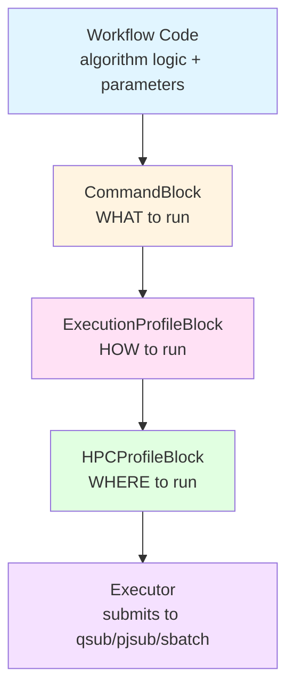
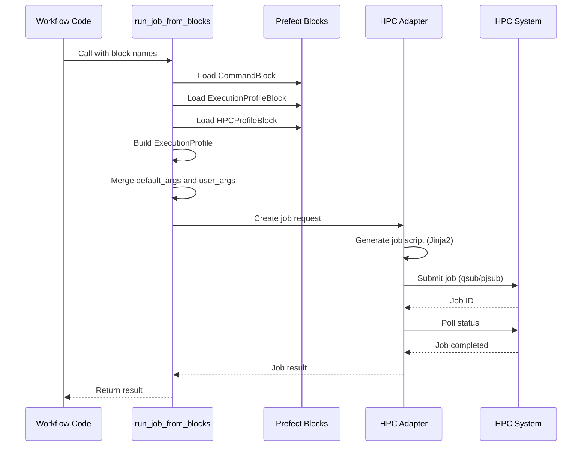

# HPC-Prefect: Portable HPC Workflow Orchestration

**HPC-Prefect** is a Python framework that enables portable workflow orchestration across multiple HPC systems (Fugaku, Miyabi, and Slurm) using [Prefect](https://www.prefect.io/). Write your workflow once and run it on any supported HPC system without modification.

## Core Concept

HPC-Prefect separates **execution intent** from **execution environment** by introducing a three-layer block architecture:



This architecture allows:
- **Workflow portability**: Same workflow code runs on different HPC systems
- **Centralized expertise**: HPC administrators encode best practices in reusable blocks
- **User flexibility**: Users can tune resources without understanding system details

---

## Project Structure

This is a monorepo workspace containing four core packages:

```
qcsc-prefect/
├── packages/
│   ├── qcsc-prefect-core/          # Core models (ExecutionProfile)
│   ├── qcsc-prefect-blocks/        # Prefect Block definitions
│   ├── qcsc-prefect-adapters/      # HPC-specific job builders & runtimes
│   └── qcsc-prefect-executor/      # High-level execution API
├── examples/
└── docs/
    └── concept.md
```

### Package Overview

#### [`qcsc-prefect-core`](https://github.com/qiskit-community/qcsc-prefect/tree/main/packages/qcsc-prefect-core)
Core data models and resolution logic. Defines [`ExecutionProfile`](https://github.com/qiskit-community/qcsc-prefect/blob/main/packages/qcsc-prefect-core/src/qcsc_prefect_core/models/execution_profile.py) which represents execution intent independent of any specific HPC system.

#### [`qcsc-prefect-blocks`](https://github.com/qiskit-community/qcsc-prefect/tree/main/packages/qcsc-prefect-blocks)
Prefect Block definitions for the three-layer architecture:
- [`CommandBlock`](https://github.com/qiskit-community/qcsc-prefect/blob/main/packages/qcsc-prefect-blocks/src/qcsc_prefect_blocks/common/blocks.py): Defines WHAT to execute (command name, executable key)
- [`ExecutionProfileBlock`](https://github.com/qiskit-community/qcsc-prefect/blob/main/packages/qcsc-prefect-blocks/src/qcsc_prefect_blocks/common/blocks.py): Defines HOW to execute (nodes, MPI ranks, walltime, modules)
- [`HPCProfileBlock`](https://github.com/qiskit-community/qcsc-prefect/blob/main/packages/qcsc-prefect-blocks/src/qcsc_prefect_blocks/common/blocks.py): Defines WHERE to execute (queue, project/group, system-specific settings)

#### [`qcsc-prefect-adapters`](https://github.com/qiskit-community/qcsc-prefect/tree/main/packages/qcsc-prefect-adapters)
HPC system-specific adapters that handle job script generation and submission:
- [`miyabi`](https://github.com/qiskit-community/qcsc-prefect/tree/main/packages/qcsc-prefect-adapters/src/qcsc_prefect_adapters/miyabi): PBS/Torque adapter for Miyabi
- [`fugaku`](https://github.com/qiskit-community/qcsc-prefect/tree/main/packages/qcsc-prefect-adapters/src/qcsc_prefect_adapters/fugaku): PJM adapter for Fugaku
- [`slurm`](https://github.com/qiskit-community/qcsc-prefect/tree/main/packages/qcsc-prefect-adapters/src/qcsc_prefect_adapters/slurm): Slurm adapter for generic clusters
- Job script templates using Jinja2
- Runtime classes for job submission, monitoring, and cancellation

For local Slurm testing with Docker, see
[`docs/howto/howto_test_slurm_with_docker_cluster.md`](./howto/howto_test_slurm_with_docker_cluster.md).

#### [`qcsc-prefect-executor`](https://github.com/qiskit-community/qcsc-prefect/tree/main/packages/qcsc-prefect-executor)
High-level execution API that orchestrates the entire workflow:
- [`run_job_from_blocks()`](https://github.com/qiskit-community/qcsc-prefect/blob/main/packages/qcsc-prefect-executor/src/qcsc_prefect_executor/from_blocks.py): Main entry point for block-based execution
- Scheduler resolution helpers such as `resolve_submission_target()` and `build_scheduler_script_filename()`
- System-specific runners: [`run_miyabi_job()`](https://github.com/qiskit-community/qcsc-prefect/blob/main/packages/qcsc-prefect-executor/src/qcsc_prefect_executor/miyabi/run.py), [`run_fugaku_job()`](https://github.com/qiskit-community/qcsc-prefect/blob/main/packages/qcsc-prefect-executor/src/qcsc_prefect_executor/fugaku/run.py)
- Automatic block resolution and job lifecycle management

---

## Quick Start

### 1. Installation

```bash
# Clone the repository
git clone <repository-url>
cd qcsc-prefect

# Install dependencies using uv (recommended)
uv sync

# Or using pip
pip install -e packages/qcsc-prefect-core
pip install -e packages/qcsc-prefect-blocks
pip install -e packages/qcsc-prefect-adapters
pip install -e packages/qcsc-prefect-executor
```

### 2. Register Block Types

```bash
# Register blocks with Prefect
uv run prefect block register -m qcsc_prefect_blocks.common.blocks
```

### 3. Create Blocks

Create blocks programmatically or via Prefect UI. Example for Miyabi:

```python
from qcsc_prefect_blocks.common.blocks import (
    CommandBlock,
    ExecutionProfileBlock,
    HPCProfileBlock,
)

# Define WHAT to run
cmd = CommandBlock(
    command_name="my-simulation",
    executable_key="simulation_binary",
    description="My HPC simulation",
)
cmd.save("cmd-my-simulation", overwrite=True)

# Define HOW to run
exec_profile = ExecutionProfileBlock(
    profile_name="simulation-mpi-16",
    command_name="my-simulation",
    resource_class="cpu",
    num_nodes=2,
    mpiprocs=8,
    walltime="01:00:00",
    launcher="mpiexec.hydra",
    modules=["intel/2023.2.0", "impi/2021.10.0"],
)
exec_profile.save("exec-simulation-mpi-16", overwrite=True)

# Define WHERE to run (Miyabi-specific)
hpc_profile = HPCProfileBlock(
    hpc_target="miyabi",
    queue_cpu="regular-c",
    queue_gpu="regular-g",
    project_cpu="your-project-id",
    project_gpu="your-project-id",
    executable_map={"simulation_binary": "/path/to/simulation"},
)
hpc_profile.save("hpc-miyabi", overwrite=True)
```

### 4. Run Your Workflow

```python
from prefect import flow
from qcsc_prefect_executor.from_blocks import (
    build_scheduler_script_filename,
    run_job_from_blocks,
)

@flow
async def my_workflow():
    result = await run_job_from_blocks(
        command_block_name="cmd-my-simulation",
        execution_profile_block_name="exec-simulation-mpi-16",
        hpc_profile_block_name="hpc-miyabi",
        work_dir="./work/my-simulation",
        script_filename=build_scheduler_script_filename("my_simulation", "miyabi"),
        user_args=["--input", "data.txt"],
    )
    return result

# Run the workflow
import asyncio
asyncio.run(my_workflow())
```

---

## Design Principles

### 1. Separation of Concerns

- **Workflow developers** focus on algorithm logic
- **HPC administrators** encode system expertise in blocks
- **Users** select appropriate profiles and tune as needed

### 2. Portability

The same workflow code runs on different HPC systems by switching the
appropriate execution/target profile pair. In many real workflows,
`launcher`, `modules`, and other execution settings differ across systems or
CPU/GPU routes, so both `ExecutionProfileBlock` and `HPCProfileBlock` may
change together. When the execution recipe is truly portable, the same
`ExecutionProfileBlock` can still be reused across multiple targets.

The workflow can keep a logical script stem and let
`build_scheduler_script_filename()` choose the scheduler-specific suffix:

```python
from qcsc_prefect_executor.from_blocks import build_scheduler_script_filename

# Run on Miyabi
result = await run_job_from_blocks(
    command_block_name="cmd-simulation",
    execution_profile_block_name="exec-simulation-miyabi",
    hpc_profile_block_name="hpc-miyabi",
    work_dir="./work/simulation",
    script_filename=build_scheduler_script_filename("simulation", "miyabi"),
)

# Run on Fugaku (same workflow code!)
result = await run_job_from_blocks(
    command_block_name="cmd-simulation",
    execution_profile_block_name="exec-simulation-fugaku",
    hpc_profile_block_name="hpc-fugaku",
    work_dir="./work/simulation",
    script_filename=build_scheduler_script_filename("simulation", "fugaku"),
)
```

### 3. Centralized Expertise

HPC administrators create and maintain execution profiles that encode:
- Optimal resource configurations
- Required modules and environment variables
- MPI launcher settings and options
- System-specific best practices

Users benefit from this expertise without needing deep HPC knowledge.

### 4. Controlled Flexibility

Users can keep workflow code stable while changing behavior by:
- Switching block instances (`execution_profile_block_name`, `hpc_profile_block_name`)
- Passing command-line arguments via `user_args`
- Preparing multiple execution profiles (for example small/large scale) and selecting one at runtime

---

## Supported HPC Systems

| System | Scheduler | Status | Adapter Module |
|--------|-----------|--------|----------------|
| **Miyabi** | PBS/Torque | Supported | [`qcsc_prefect_adapters.miyabi`](https://github.com/qiskit-community/qcsc-prefect/tree/main/packages/qcsc-prefect-adapters/src/qcsc_prefect_adapters/miyabi) |
| **Fugaku** | PJM | Supported | [`qcsc_prefect_adapters.fugaku`](https://github.com/qiskit-community/qcsc-prefect/tree/main/packages/qcsc-prefect-adapters/src/qcsc_prefect_adapters/fugaku) |
| **Slurm** | Slurm | Supported | [`qcsc_prefect_adapters.slurm`](https://github.com/qiskit-community/qcsc-prefect/tree/main/packages/qcsc-prefect-adapters/src/qcsc_prefect_adapters/slurm) |

---

## Architecture Details

### Block Resolution Flow



### Execution Profile Model

The [`ExecutionProfile`](https://github.com/qiskit-community/qcsc-prefect/blob/main/packages/qcsc-prefect-core/src/qcsc_prefect_core/models/execution_profile.py) is the central data model representing execution intent:

```python
@dataclass
class ExecutionProfile:
    command_key: str
    num_nodes: int
    mpiprocs: int
    ompthreads: int | None
    walltime: str
    launcher: Literal["single", "mpirun", "mpiexec", "mpiexec.hydra"]
    mpi_options: list[str]
    modules: list[str]
    environments: dict[str, str]
    arguments: list[str]
```

This model is system-agnostic and gets translated to system-specific job requests by adapters.
