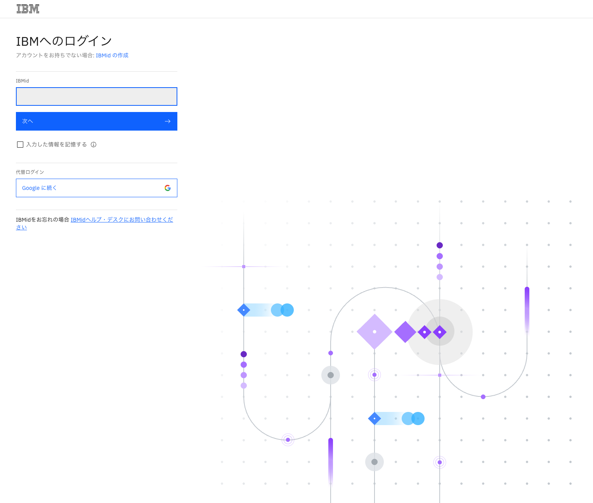
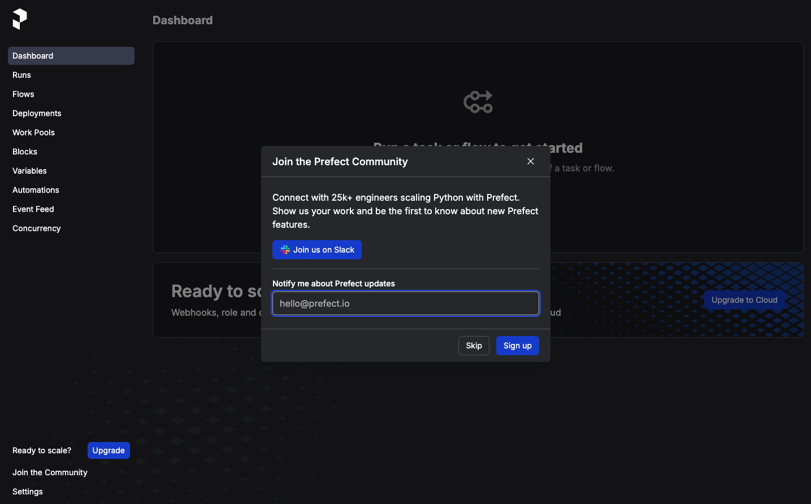
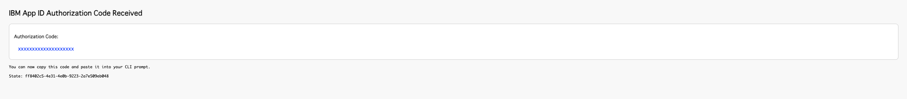

# How to Connect to Prefect Web Portal from MDX (On-Prem or Prefect Cloud)

This guide explains two supported ways to use Prefect from MDX:

- **Option A: On-Prem Prefect on MDX** (`prefect-portal-host`)
- **Option B: Prefect Cloud** (`https://app.prefect.cloud`)

Choose one backend and use it consistently for block creation, variable creation, and flow runs.

## Prerequisites

Before you begin, ensure the following:

- You can access the MDX workflow client.
- You have created a Python virtual environment by following [How to Set Up Python Environment on the MDX Workflow Server](./howto_setup_python_env.md).
- You have Prefect installed in that environment (`uv pip install prefect`).
- You will use one of the following:
  - On-Prem: an account provisioned by your administrator
  - Prefect Cloud: a Prefect Cloud account and API key

## Instructions

> [!IMPORTANT]
> Replace `z12345` with your actual account name.

### Step 1: Log in to the MDX Workflow Client

Connect to the MDX workflow client:

<br>
```bash
ssh -A z12345@mdx-workflow.example.org
```

Activate your virtual environment:

<br>
```bash
source ~/venv/prefect/bin/activate
```
### Step 2: Storage setup on MDX and Clone git repository

The home directory size on the MDX workflow client may be limited.
You can place Prefect local files on `/large`:

<br>
```bash
mkdir -p /large/z12345/.prefect
mv ~/.prefect ~/.prefect.bak.$(date +%Y%m%d%H%M%S) 2>/dev/null || true
ln -sfn /large/z12345/.prefect ~/.prefect
```

After this, you clone the tutorial repository:

<br>
```bash
cd /work/gz00/z12345
git clone git@github.com:hitomitak/qcsc-prefect.git
```

### Step 3: Choose your Prefect backend

Use either **A (On-Prem)** or **B (Prefect Cloud)**.

---

### Step 3A: Connect to On-Prem Prefect on MDX

Open the following URL in your browser:

```bash
https://prefect-portal.example.org/z12345/
```

You will be redirected to the SSO login page.
Use the same email address that was registered by the administrator.




From the MDX shell, run:

<br>
```bash
prefect-auth login
```

When prompted, open the generated URL, complete IBMid login, and paste the returned `code` value into the terminal.

```text
prefect-auth login
# Using SSO login flow.

# Please open this URL in your browser and log in via SSO:
https://us-south.appid.cloud.ibm.com/oauth/v4/xxxxxxxxx/authorization?client_id=xxxxxxxxxxxxxxxxx&response_type=code&scope=openid%20email%20profile%20offline_access&redirect_uri=https%3A%2F%2Fprefect-portal.example.org%2Ftoken-callback&state=xxxxxxxxxxxx

After login, copy the URL you were redirected to and paste the 'code' parameter below.

Authorization code: 
```



Create and use an on-prem profile:

<br>
```bash
prefect profile create mdx
/work/gz00/z12345/qcsc-prefect/scripts/prefect_sync_env_to_config.sh -p mdx
```

Check current configuration:

<br>
```bash
prefect config view
```

Expected values include:

```text
PREFECT_PROFILE='mdx'
PREFECT_API_URL='https://prefect-portal.example.org/z12345/api'
PREFECT_CLIENT_CUSTOM_HEADERS='{"Authorization":"Bearer ..."}'
```

---

### Step 3B: Connect to Prefect Cloud

Open Prefect Cloud in your browser:

```bash
https://app.prefect.cloud
```

Create an API key from **Profile Settings -> API Keys**.


On the MDX shell, create and use a cloud profile:

<br>
```bash
prefect profile create mdx
prefect profile use mdx
prefect cloud login --key "<PREFECT_API_KEY>"
```

Check current configuration:

<br>
```bash
prefect config view
```

Expected values include:

```text
PREFECT_PROFILE='mdx'
PREFECT_API_URL='https://api.prefect.cloud/api/accounts/.../workspaces/...'
```

> [!NOTE]
> On the Prefect Cloud Hobby (free) tier, workflow metadata retention is 7 days.

---


### Step 4: Test Run

Run a simple flow to verify your selected backend is reachable:

<br>
```bash
prefect shell watch 'echo Hello World'
```

You will see output like:

```text
01:53:39.122 | INFO    | Flow run 'industrious-rooster' - Beginning flow run 'industrious-rooster' for flow 'Shell Command'
01:53:39.132 | INFO    | Flow run 'industrious-rooster' - View at ...
01:53:39.138 | INFO    | Flow run 'industrious-rooster' - Hello World
01:53:39.158 | INFO    | Flow run 'industrious-rooster' - Finished in state Completed()
```

If this step succeeds, your MDX environment is ready for block/variable operations on the selected backend.

---
*END OF GUIDE*
