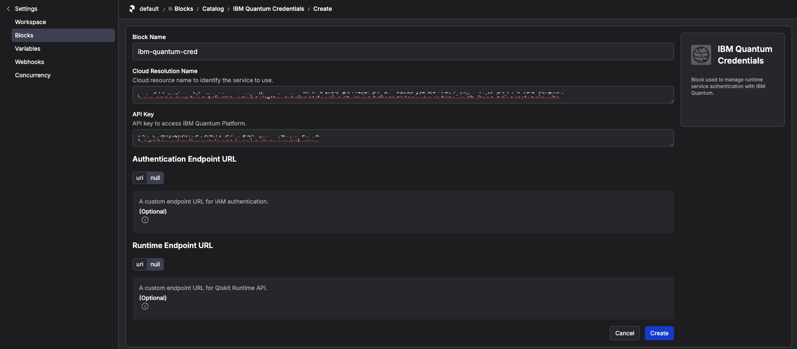
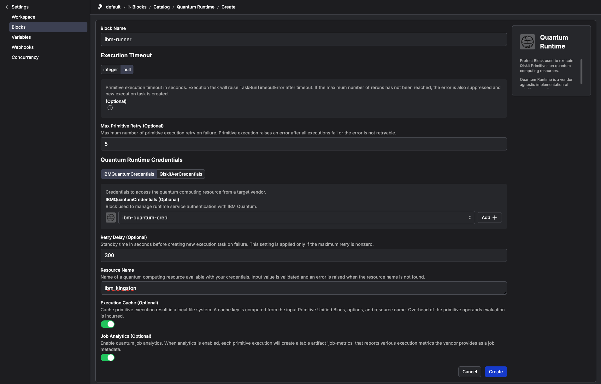

# How to Set Up IBM Quantum Access Credentials for Prefect

This guide explains how to configure Prefect Qiskit integration to access IBM Quantum services from the MDX workflow server.

## Prerequisites

Before you begin, ensure the following:

- You have created a Python virtual environment by following [How to Set Up Python Environment on Fugaku](./howto_setup_python_env_fugaku.md).
- You have generated an API Key for the [IBM Quantum Platform](https://quantum.cloud.ibm.com/).


If you use Prefect Cloud for workflow management, also ensure:

- You have created an API Key for the [Prefect Cloud](https://www.prefect.io/cloud) workspace.

## Instructions

### Step 1: Execute the interact session for Pre/Post Node.

Execute the interact session for Pre/Post Node.

<br>
```bash
srun -p mem2 -n 1 --mem 4G --time=60 --pty bash -i
```

### Step 2: Install Prefect Qiskit Package

Activate your virtual environment:

<br>
```bash
source ~/venv/prefect/bin/activate
```
Install the Prefect Qiskit integration:

<br>
```bash
uv pip install prefect-qiskit
export SSL_CERT_FILE=$(python -c 'import certifi; print(certifi.where())')
```
If `SSL_CERT_FILE` is not set, IBM Quantum access may fail with
`[SSL: CERTIFICATE_VERIFY_FAILED] unable to get local issuer certificate`.


### Step 3: Configure Prefect Profile

Create API Key in Prefect Cloud. Settings -> API Keys


Create and switch to a new Prefect profile:

<br>
```bash
prefect profile create cloud-fugaku && prefect profile use cloud-fugaku
```

Log in to your Prefect Cloud workspace using your API key:

<br>
```bash
prefect cloud login -k '<my-api-key>'
```

### Step 4: Register IBM Quantum Blocks

Register the block schemas for Qiskit integration:

<br>
```bash
prefect block register -m prefect_qiskit
prefect block register -m prefect_qiskit.vendors
```

Create the IBM Quantum Credentials block:

<br>
```bash
prefect block create ibm-quantum-credentials
```

This command will display a URL to the Prefect console.
Open it in your browser and enter your IBM Quantum instance's CRN and API Key to create the block.




Then, enter the following:

<br>
```bash
prefect block create quantum-runtime
```

Follow the URL shown to configure the runtime block.
Specify the IBM Quantum backend name and link the credentials block you created above.
You can also configure preferences for Qiskit primitive execution.



> [!NOTE]
> If a real IBM Quantum backend such as `ibm_kobe` is not available, you can configure Qiskit Aer as an alternative backend.
> Follow the official prefect-qiskit tutorial here:
> [Use Qiskit Aer](https://github.com/qiskit-community/prefect-qiskit/blob/main/docs/tutorials/01_getting_started.md#use-qiskit-aer)
>
> In the Aer setup, create a `Qiskit Aer Credentials` block and configure the `QuantumRuntime` block with `Resource Name = aer_simulator`.
> If you already created the tutorial Variable for the Fugaku workflow, delete it from Prefect before switching to Aer because it cannot be used in this setup:
> `fugaku-bitcount-options`

Confirm you have access to the blocks you created:

<br>
```bash
prefect block ls
```

Example output:

```
┏━━━━━━━━━━━━━━━━━━━━━━━━┳━━━━━━━━━━━┳━━━━━━━━━━━━━┳━━━━━━━━━━━━━━━━━━━━━━━━━━━━━━━━━━┓
┃ ID                     ┃ Type      ┃ Name        ┃ Slug                             ┃
┡━━━━━━━━━━━━━━━━━━━━━━━━╇━━━━━━━━━━━╇━━━━━━━━━━━━━╇━━━━━━━━━━━━━━━━━━━━━━━━━━━━━━━━━━┩
│ 9d87e2a8-e7b8-4e3b-98… │ IBM Quan… │ ibm-quantu… │ ibm-quantum-credentials/ibm-qua… │
│ 8c9e4ff7-b09a-4f11-bc… │ Quantum … │ ibm-runner  │ quantum-runtime/ibm-runner       │
└────────────────────────┴───────────┴─────────────┴──────────────────────────────────┘
```

If the blocks don't appear, it's likely that the Prefect profile setup failed.
Go back to **Step 3** and ensure you have successfully logged in to the Prefect Cloud workspace.
