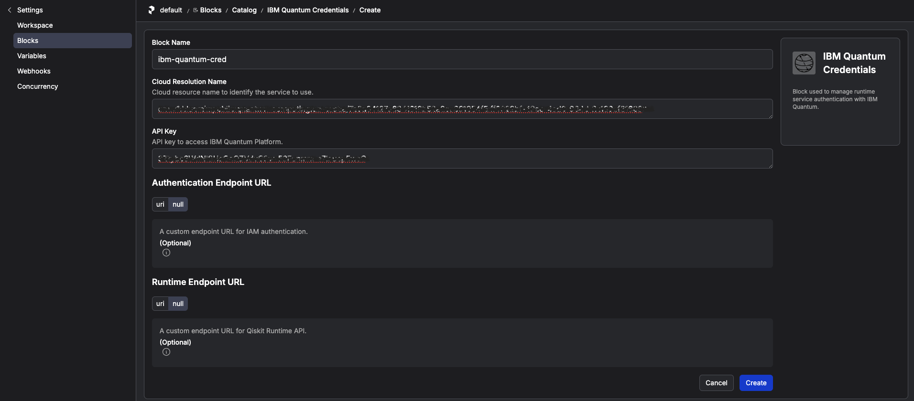
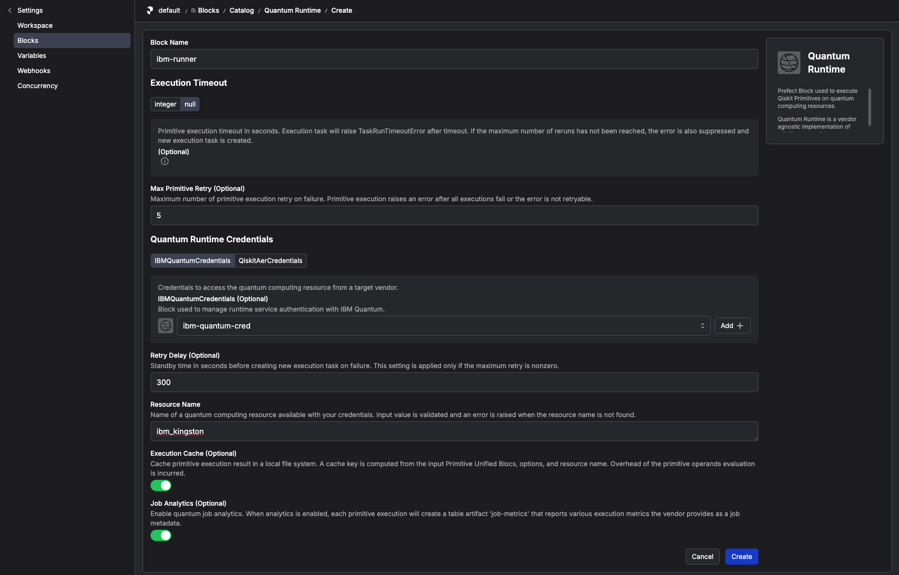

# How to Set Up IBM Quantum Access Credentials for Prefect in a Local Slurm Environment

This guide explains how to configure the Prefect Qiskit integration to access IBM Quantum services from a Slurm workflow environment.

You will create two Prefect Blocks:

1. `IBMQuantumCredentials`
2. `QuantumRuntime`

These Blocks store the IBM Quantum credentials and runtime configuration used by workflows that execute quantum workloads on IBM Quantum.

---

## Step 1: Log in to the Slurm login node

Connect to the login node of your Slurm cluster:

```bash
ssh user@login-node
```

Clone the `qcsc-prefect` repository:

```bash
git clone https://github.com/qiskit-community/qcsc-prefect.git
cd qcsc-prefect
```

Activate the Python environment used by the workflow:

```bash
source .venv/bin/activate
```

---

## Step 2: Install the Prefect Qiskit integration

Install the Prefect Qiskit integration if it is not already available in your environment:

```bash
uv pip install prefect-qiskit
```

Verify the installation:

```bash
uv pip show prefect-qiskit
```

---

## Step 3: Verify the Prefect server connection

Before creating the Blocks, make sure the Prefect client is connected to the Prefect server used by your workflow.

Check the current Prefect configuration:

```bash
prefect config view
```

Verify that the server is accessible:

```bash
prefect server status
```

For a small or tutorial environment, the Prefect server can run directly on the Slurm login node.

### Optional: Run a Prefect server on the login node

For a small or tutorial environment, you can run the Prefect server directly on the Slurm login node:

```bash
prefect server start --host 0.0.0.0 --background
```

Configure the Prefect client to use this server:

```bash
prefect config set PREFECT_API_URL=http://127.0.0.1:4200/api
```

Verify that the server is accessible:

```bash
prefect server status
```

This setup is convenient for a single-user tutorial or test environment.

---

## Step 4: Register IBM Quantum Blocks

### 4.1 Register Prefect-Qiskit block schemas

Register the block schemas for the Qiskit integration:

```bash
prefect block register -m prefect_qiskit
prefect block register -m prefect_qiskit.vendors
```

This only needs to be done once for a Prefect environment.

---

### 4.2 Create the IBM Quantum credentials block

Create an IBM Quantum Credentials block:

```bash
prefect block create ibm-quantum-credentials
```

The command displays a URL. Open the URL in your browser and configure the block with the following values:

| Field | Value |
|---|---|
| Block Name | `ibm-quantum-cred` |
| Cloud Resource Name (CRN) | A string starting with `crn:v1:bluemix:...` from IBM Cloud |
| API Key | Your IBM Cloud API key |

Save the block.

<!-- IMAGE PLACEHOLDER: IBM Quantum Credentials block -->



*IBM Quantum credentials configured as a Prefect block.*

---

### 4.3 Create the Quantum Runtime block

Create a `QuantumRuntime` block:

```bash
prefect block create quantum-runtime
```

Open the displayed URL in your browser and configure the runtime block:

| Field | Value |
|---|---|
| Block Name | `ibm-runner` |
| Resource Name | Your IBM Quantum backend or resource name |
| Quantum Runtime Credentials | Select `ibm-quantum-cred` |
| Job Analytics | Enabled |

Save the block.



*IBM Quantum Runtime configuration used by the workflow.*

---

## Step 5: Verify the Blocks

Confirm that the Blocks were created successfully:

```bash
prefect block ls
```

The output should include the IBM Quantum credentials and runtime Blocks:

```text
Blocks
┏━━━━━━━━━━━━━━━━━━━━━━━━━━━━━━━━━━━━━━┳━━━━━━━━━━━━━━━━━━━━━━━━━┳━━━━━━━━━━━━━━━━━━┳━━━━━━━━━━━━━━━━━━━━━━━━━━━━━━━━━━━━━━━━━━━━┓
┃ ID                                   ┃ Type                    ┃ Name             ┃ Slug                                       ┃
┡━━━━━━━━━━━━━━━━━━━━━━━━━━━━━━━━━━━━━━╇━━━━━━━━━━━━━━━━━━━━━━━━━╇━━━━━━━━━━━━━━━━━━╇━━━━━━━━━━━━━━━━━━━━━━━━━━━━━━━━━━━━━━━━━━━━┩
│ <block-id>                           │ IBM Quantum Credentials │ ibm-quantum-cred │ ibm-quantum-credentials/ibm-quantum-cred │
│ <block-id>                           │ Quantum Runtime         │ ibm-runner       │ quantum-runtime/ibm-runner                 │
└──────────────────────────────────────┴─────────────────────────┴──────────────────┴────────────────────────────────────────────┘
```

The block IDs are generated by Prefect and will be different for each environment.

You can also verify the Blocks from the Prefect UI.

---

END OF GUIDE
