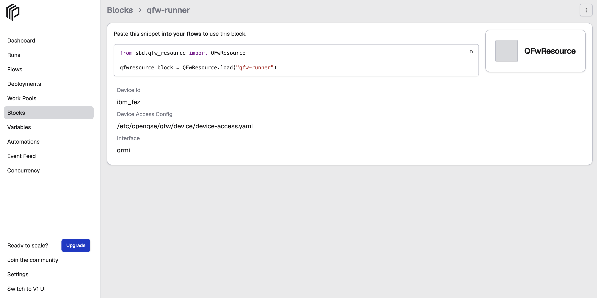

# Create and Register a QFw Resource Block

The `QFwResource` Prefect block stores the configuration needed to access a quantum device through QFw.

Use this block when the SQD workflow is configured with:

```text
quantum_source = "qfw"
```

## 1. Prerequisites

Before creating the `QFwResource` block:

- The QFw-SLURM container environment must be running.
- QFw/QRMI and the target quantum device must be configured at `/etc/openqse/qfw/device/device-access.yaml`.
- A Prefect server must be running and the active Prefect profile must point to that server.
- The QFw device-access configuration and provider credentials must already be available.

For Prefect server setup in the QFw-SLURM environment, see [How to Run and Access a Prefect Server on a Slurm Login Node](howto_setup_prefect_server_slurm.md).

Provider credentials should remain in the QFw credential configuration rather than being duplicated directly in the Prefect block.

## 2. Register the QFw Resource Block Type

The `QFwResource` block contains the information needed to locate and access a QFw device resource.

The block implementation is located at:

```text
/path/to/qcsc-prefect/algorithms/sbd/sbd/qfw_resource.py
```
Register the block type with Prefect:

```bash
prefect block register -f /path/to/qcsc-prefect/algorithms/sbd/sbd/qfw_resource.py
```
The registered block will appear like this:

```text

Successfully registered 1 block

┏━━━━━━━━━━━━━━━━━━━┓
┃ Registered Blocks ┃
┡━━━━━━━━━━━━━━━━━━━┩
│ QFwResource       │
└───────────────────┘

 To configure the newly registered blocks, go to the Blocks page in the Prefect UI: http://127.0.0.1:4200/blocks/catalog

```

## 3. Create the QFw Resource Block Instance

Create and save the `qfw-runner` block instance using:

```bash
python /path/to/qcsc-prefect/algorithms/sbd/create_qfw_block.py
```
The default QFw resource configuration is:

| Parameter | Default value |
|---|---|
| `device_id` | `ibm_fez` |
| `device_access_config` | `/etc/openqse/qfw/device/device-access.yaml` |
| `interface` | `qrmi` |

Update these values if your QFw-SLURM environment uses a different device, configuration path or interface library.

## 4. Verify the Block Instance

Check that the named block instance was created:

```bash
prefect block ls
```
The block should appear with the name `qfw-runner`.

```text
                                           Blocks
┏━━━━━━━━━━━━━━━━━━━━━━━━━━━━━━━━━━━━━━┳━━━━━━━━━━━━━┳━━━━━━━━━━━━┳━━━━━━━━━━━━━━━━━━━━━━━━┓
┃ ID                                   ┃ Type        ┃ Name       ┃ Slug                   ┃
┡━━━━━━━━━━━━━━━━━━━━━━━━━━━━━━━━━━━━━━╇━━━━━━━━━━━━━╇━━━━━━━━━━━━╇━━━━━━━━━━━━━━━━━━━━━━━━┩
│ <block_id>                           │ QFwResource │ qfw-runner │ qfwresource/qfw-runner │
└──────────────────────────────────────┴─────────────┴────────────┴────────────────────────┘
```
You can see it on the Prefect UI under `Blocks`



The block details should show the configured device ID, device-access configuration path and interface.You can also edit the block configuration from the Prefect UI by selecting the three-dot menu on the right.


