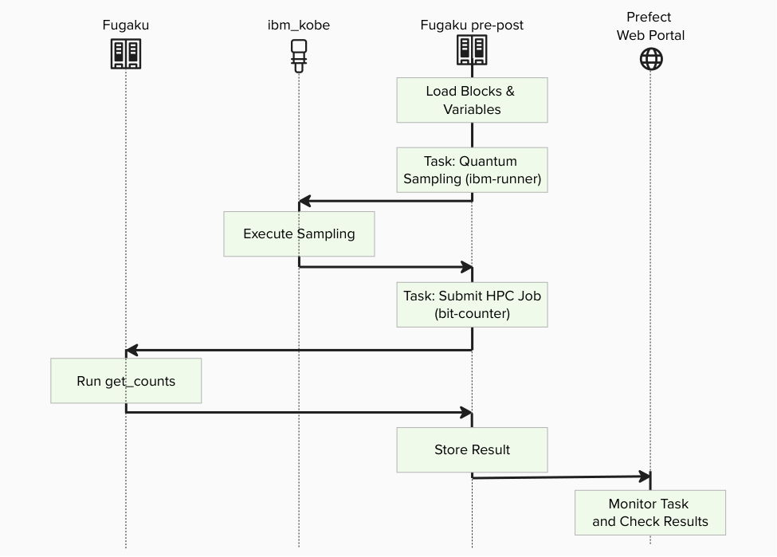
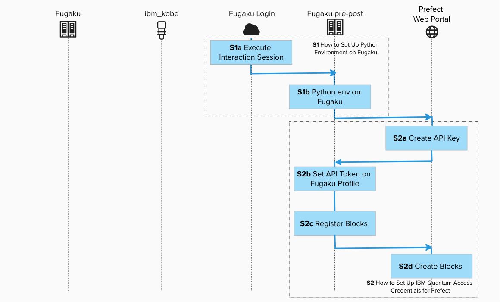

# Create Your QCSC Workflow with Prefect for Fugaku

This hands-on tutorial guides you through building a small C++ program on the Fugaku environment and integrating it into a Prefect workflow using a custom `FugakuJobBlock` class.
On the Prefect workflow, we also use [Prefect Qiskit](https://github.com/qiskit-community/prefect-qiskit) to show how to write a complete QCSC workflow from scratch.

Our objective is to compute a count dictionary of sampler bitstrings using MPI programming on the QCSC architecture.



Key principles in this tutorial:

- Users do not write new Python code for BitCount
- Blocks are not created manually in UI; they are generated by `create_blocks.py`
- Workflows run by specifying block names
- Existing assets are reused as-is from `examples/prefect_bitcount_demo`

---

## Prefect Core Concepts (quick mapping with [Introduction to Prefect](./Prefect_tutorial_miyabi.pdf))

You will see these terms:
- **Flow**: the end-to-end workflow entrypoint
  - `examples/prefect_bitcount_demo/flow_optimized.py`
- **Task**: individual units executed inside a flow
  - `quantum-sampling-task` in `flow_optimized.py`
  - `hpc-bitcount-task` in `flow_optimized.py`
- **Block**: reusable server-side configuration stored in Prefect
  - `IBM Quantum Credentials`: IBM Cloud CRN + API key
  - `QuantumRuntime` block: `ibm-runner` (pre-created)
  - `CommandBlock`: `cmd-bitcount-hist`
  - `ExecutionProfileBlock`: `exec-bitcount-fugaku`
  - `HPCProfileBlock`: `hpc-fugaku-bitcount`
- **Variable**: server-side runtime parameters
  - `fugaku-bitcount-options`

## What you need

- **Accounts / IDs**: (a) Fugaku account, (b) Prefect Web Portal account (API Key), (c) IBM Cloud API key + Service CRN (Quantum)
- **Local tools**: SSH client and a modern browser.  

---

## Prerequisites (One-time setup)

The whole process image is : 



Before starting, make sure:

- You have completed [Step1 : How to Set Up Python Environment on Fugaku Pre/Post Node](../howto/howto_setup_python_env_fugaku.md).
- You have completed [Step2 : How to Set Up IBM Quantum Access Credentials for Prefect](../howto/howto_setup_prefect_qiskit_fugaku.md).

> [!IMPORTANT]
> Replace `ra00000`, `u12345` and `vol0000x` with your actual group, account name and mount volume.

---

## Existing files used in this tutorial

- `../../examples/prefect_bitcount_demo/build_on_fugaku.sh`
- `../../examples/prefect_bitcount_demo/create_blocks.py`
- `../../examples/prefect_bitcount_demo/bitcount_blocks.example.toml`
- `../../examples/prefect_bitcount_demo/flow_optimized.py`
- `../../examples/prefect_bitcount_demo/src/get_counts_json.cpp`
- `../../examples/prefect_bitcount_demo/src/get_counts_hist.cpp`

All steps below use these files as-is.

---

## Create BitCounts Workflow on Fugaku


## Step 1: Log in to Fugaku and execute the interact session for Pre/Post Node

<br>
```bash
ssh -A <your_account>@<fugaku_login_host>
```

Execute the interact session for Pre/Post Node in the login node.

<br>
```bash
srun -p mem2 -n 1 --mem 4G --time=60 --pty bash -i
```
## Step 2. Create a Project Directory repository(Pre/Post Node)

Create a project directory:

<br>
```bash
mkdir fugaku_tutorial && cd fugaku_tutorial
```

## Step 3. Prepare Prefect and Quantum runtime (Pre/Post Node)

<br>
```bash
cd /path/to/work

git clone git@github.com:hitomitak/hpc-prefect.git
cd hpc-prefect

source ~/venv/prefect/bin/activate
uv pip install prefect-qiskit
uv pip install --no-deps \
  -e packages/hpc-prefect-core \
  -e packages/hpc-prefect-adapters \
  -e packages/hpc-prefect-blocks \
  -e packages/hpc-prefect-executor
```


Use Fugaku cloud profile

<br>
```bash
prefect profile use cloud-fugaku
```

## Step 4. Build MPI program on Fugaku (Login Node)

<br>
```bash
ssh -A <your_account>@<fugaku_login_host>
```

Open a new terminal and connect to the login node and execute the build script.

<br>
```bash
cd /path/to/work/hpc-prefect
./examples/prefect_bitcount_demo/build_on_fugaku.sh
```

Generated binaries:

- `examples/prefect_bitcount_demo/bin/get_counts_json`
- `examples/prefect_bitcount_demo/bin/get_counts_hist`

Get the absolute path to the `get_counts` executable:

<br>
```bash
realpath ./examples/prefect_bitcount_demo/bin/get_counts_hist
```
Example output:

```text
/vol000x/mdt6/data/ra00000/u12345/hpc-prefect/examples/prefect_bitcount_demo/bin/get_counts_hist
```

### Step 4.1. What `get_counts_json` and `get_counts_hist` do

Both programs implement the same MPI bit-count pipeline:

1. Read `input.bin` (array of `uint32`) generated from sampler bitstrings.
2. Split data across MPI ranks.
3. Build local histograms for values in `[0, 2^BITLEN)` (`BITLEN=10`).
4. Reduce local histograms to rank 0 and write one output file.

Differences:

- `get_counts_json`
  - Uses `MPI_Scatter` (equal-size partition).
  - Writes sparse JSON (`output.json`).
- `get_counts_hist`
  - Uses `MPI_Scatterv` (non-even partition handling).
  - Writes fixed-size binary histogram (`hist_u64.bin`).
  - Used by default (`executable_key=bitcount_hist`).

---

## Step 5. Prepare block configuration file (Pre/Post Node)

<br>
```bash
cd /path/to/work/hpc-prefect
cp examples/prefect_bitcount_demo/bitcount_blocks.example.toml \
   examples/prefect_bitcount_demo/bitcount_blocks.toml
vim examples/prefect_bitcount_demo/bitcount_blocks.toml
```

Set at least these keys for Fugaku:

- `hpc_target = "fugaku"`
- `project` (Fugaku project e.g. ra00000)
- `queue` (Fugaku rscgrp, e.g. `small`)
- `work_dir`
- `optimized_executable` (absolute path to `get_counts_hist`)

Optional Fugaku keys:

- `fugaku_gfscache`
- `fugaku_spack_modules`
- `fugaku_mpi_options_for_pjm`

---

## Step 6. Generate blocks by script (Pre/Post Node)

<br>
```bash
python examples/prefect_bitcount_demo/create_blocks.py \
  --config examples/prefect_bitcount_demo/bitcount_blocks.toml \
  --hpc-target fugaku
```

### Step 6.1. What this creates (default names)

| Type | Default name | Purpose |
|---|---|---|
| CommandBlock | `cmd-bitcount-hist` | Command definition (`executable_key=bitcount_hist`) |
| ExecutionProfileBlock | `exec-bitcount-fugaku` | Nodes, MPI settings, walltime |
| HPCProfileBlock | `hpc-fugaku-bitcount` | Fugaku rscgrp/project/executable/gfscache settings |
| Prefect Variable | `fugaku-bitcount-options` | Sampler options (shots, etc.) |

> Legacy `BitCounter` facade (`miyabi-tutorial`) is not created for Fugaku mode.

---

## Step 7. Run workflow by specifying block names (Pre/Post Node)

Use `flow_optimized.py` with Fugaku block names:

<br>
```bash
python examples/prefect_bitcount_demo/flow_optimized.py \
  --runtime-block ibm-runner \
  --command-block cmd-bitcount-hist \
  --execution-profile-block exec-bitcount-fugaku \
  --hpc-profile-block hpc-fugaku-bitcount \
  --options-variable fugaku-bitcount-options \
  --script-filename bitcount_optimized.pjm
```

In this mode, the main user inputs are block names.

### Step 7.1. What `flow_optimized.py` does

Code location:

- `../../examples/prefect_bitcount_demo/flow_optimized.py`

Execution sequence:

1. `quantum-sampling-task`
2. Load `QuantumRuntime` block (`ibm-runner`)
3. Load sampler options variable (`fugaku-bitcount-options`)
4. Build and run GHZ sampling
5. Write `input.bin` into a run-specific job directory
6. `hpc-bitcount-task`
7. Submit HPC job via `run_job_from_blocks(...)` using `CommandBlock`, `ExecutionProfileBlock`, and `HPCProfileBlock`
8. Read `hist_u64.bin`, reconstruct counts, publish artifact

---
