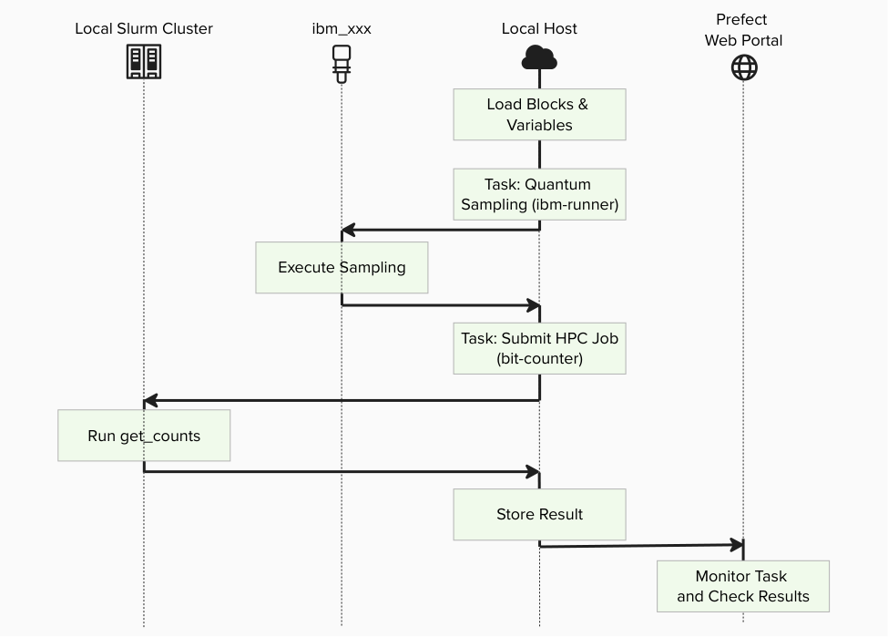
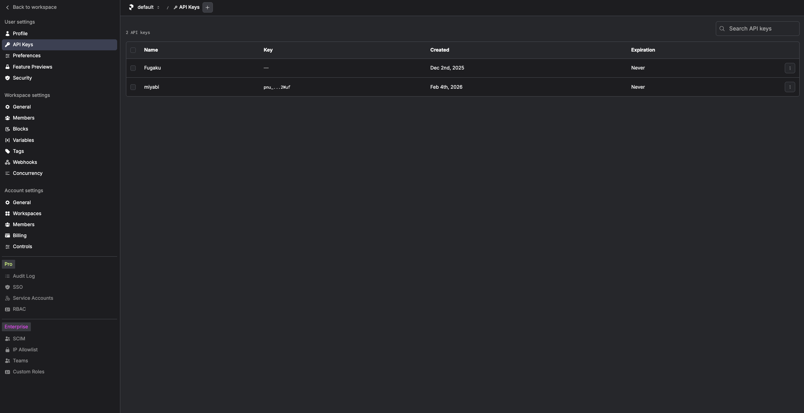

# Create Your QCSC Workflow with Prefect for Local Slurm

This hands-on tutorial guides you through running the BitCount demo on a local
Slurm cluster built with
[`slurm-docker-cluster`](https://github.com/giovtorres/slurm-docker-cluster).
The controller and worker nodes run inside Docker on your Mac, while the
workflow itself still uses the same `qcsc-prefect` flow and MPI executable
assets as the Miyabi and Fugaku tutorials.

Our objective is to compute a count dictionary of sampler bitstrings using MPI
programming on the QCSC architecture.



Key principles in this tutorial:

- Users do not write new Python flow code for BitCount
- The same `flow_optimized.py` entrypoint is reused on Slurm
- The current `create_blocks.py` helper does not yet generate Slurm assets, so
  we create the required Prefect blocks manually
- For the packaged Open MPI used in this local cluster, `mpirun` is used inside
  the Slurm allocation for MPI jobs

---

## Prefect Core Concepts

You will see these terms:

- **Flow**: the end-to-end workflow entrypoint
  - `examples/prefect_bitcount_demo/flow_optimized.py`
- **Task**: individual units executed inside a flow
  - `quantum-sampling-task` in `flow_optimized.py`
  - `hpc-bitcount-task` in `flow_optimized.py`
- **Block**: reusable server-side configuration stored in Prefect
  - `CommandBlock`: `cmd-bitcount-hist`
  - `ExecutionProfileBlock`: `exec-bitcount-slurm`
  - `HPCProfileBlock`: `hpc-slurm-bitcount`
- **Variable**: server-side runtime parameters
  - `slurm-bitcount-options`

## What you need

- A Mac with Docker and Docker Compose
- A local checkout of `qcsc-prefect`
- A reachable Prefect backend from inside the `slurmctld` container
- A running local Slurm cluster created from
  [`slurm-docker-cluster`](https://github.com/giovtorres/slurm-docker-cluster)

If you want to run against IBM Quantum Runtime later, you will also need:

- a configured `QuantumRuntime` block such as `ibm-runner`
- IBM Quantum credentials set up in the Prefect backend you use

---

## Prerequisites

Before starting, make sure:

- You have completed
  [How to Test Slurm Locally with `slurm-docker-cluster`](../howto/howto_test_slurm_with_docker_cluster.md)
  through Step 3.
- `sinfo` inside `slurmctld` shows at least two CPU workers, for example
  `c1` and `c2`.
- You know the Slurm partition name shown by `sinfo`, such as `cpu` or
  `normal`.

> [!IMPORTANT]
> All commands below run inside the `slurmctld` container unless a step
> explicitly says "from the host machine".

---

## Existing files used in this tutorial

- `../../examples/prefect_bitcount_demo/src/get_counts_hist.cpp`
- `../../examples/prefect_bitcount_demo/flow_optimized.py`
- `../../examples/prefect_bitcount_demo/quantum_sampling.py`
- `../../packages/qcsc-prefect-blocks/src/qcsc_prefect_blocks/common/blocks.py`

All steps below use these files as-is.

---

## Create BitCount Workflow on Local Slurm

## Step 1. Log in to Prefect Cloud

Open Prefect Cloud in your browser and create an API key from
**Profile Settings -> API Keys**:

```bash
https://app.prefect.cloud
```



Open a shell in the controller and activate the virtual environment:

<br>
```bash
docker exec -it slurmctld bash
```

<br>
```bash
cd /data/qcsc-prefect
. .venv/bin/activate
```

Create and switch to a dedicated Prefect profile for the local Slurm tutorial:

<br>
```bash
prefect profile create cloud-slurm-local
prefect profile use cloud-slurm-local
```

Log in to your Prefect Cloud workspace:

<br>
```bash
prefect cloud login --key "<PREFECT_API_KEY>"
```

Check the current configuration:

<br>
```bash
prefect config view
```

Expected values include:

```text
PREFECT_PROFILE='cloud-slurm-local'
PREFECT_API_URL='https://api.prefect.cloud/api/accounts/.../workspaces/...'
```

> [!NOTE]
> The Prefect blocks and variable created later in this tutorial are stored in
> the currently selected Prefect Cloud workspace.

---

## Step 2. Install local dependencies

From the host machine, install MPI build/runtime packages on the controller and
all worker containers:

<br>
```bash
for n in slurmctld slurm-cpu-worker-1 slurm-cpu-worker-2; do
  docker exec "$n" bash -lc '
    if command -v dnf >/dev/null 2>&1; then
      dnf install -y gcc gcc-c++ openmpi openmpi-devel
    else
      yum install -y gcc gcc-c++ openmpi openmpi-devel
    fi
  '
done
```

If you already opened a controller shell in Step 1, keep using it. Otherwise,
open a shell in the controller:

<br>
```bash
docker exec -it slurmctld bash
```

<br>
```bash
cd /data/qcsc-prefect
. .venv/bin/activate
```

Install Python packages required by the BitCount flow:

<br>
```bash
python -m pip install prefect-qiskit qiskit
```

> [!NOTE]
> Even when `--quantum-source random` is used, the current implementation still
> imports `prefect_qiskit` and `qiskit`, so both packages must be installed in
> the controller virtual environment.

---

## Step 3. Build the MPI executable

Prepare the Open MPI toolchain in the controller shell:

<br>
```bash
source /etc/profile.d/modules.sh 2>/dev/null || true
module load mpi/openmpi-x86_64 2>/dev/null || true
export PATH=/usr/lib64/openmpi/bin:$PATH
export LD_LIBRARY_PATH=/usr/lib64/openmpi/lib:${LD_LIBRARY_PATH:-}
```

Compile the optimized BitCount executable:

<br>
```bash
mkdir -p examples/prefect_bitcount_demo/bin
mpicxx -O3 -std=c++17 \
  -o examples/prefect_bitcount_demo/bin/get_counts_hist \
  examples/prefect_bitcount_demo/src/get_counts_hist.cpp
```

Confirm the executable path:

<br>
```bash
realpath examples/prefect_bitcount_demo/bin/get_counts_hist
```

Example output:

```text
/data/qcsc-prefect/examples/prefect_bitcount_demo/bin/get_counts_hist
```

---

## Step 4. Create the Prefect blocks for Slurm

The current helper script `examples/prefect_bitcount_demo/create_blocks.py`
supports `miyabi` and `fugaku`, but not `slurm` yet. For the local Slurm
tutorial, create the blocks directly from Python.

Run the following in the controller shell. Replace `queue_cpu="cpu"` with the
partition name you saw in `sinfo` if your cluster uses a different name.

<br>
```bash
python - <<'PY'
from qcsc_prefect_blocks.common.blocks import CommandBlock, ExecutionProfileBlock, HPCProfileBlock

for cls in (CommandBlock, ExecutionProfileBlock, HPCProfileBlock):
    register = getattr(cls, "register_type_and_schema", None)
    if callable(register):
        register()

CommandBlock(
    command_name="bitcount-hist",
    executable_key="bitcount_hist",
    description="Optimized bitcount executable (binary histogram output)",
    default_args=[],
).save("cmd-bitcount-hist", overwrite=True)

ExecutionProfileBlock(
    profile_name="bitcount-slurm",
    command_name="bitcount-hist",
    resource_class="cpu",
    num_nodes=2,
    mpiprocs=1,
    ompthreads=1,
    walltime="00:05:00",
    launcher="mpirun",
    mpi_options=["--allow-run-as-root"],
    modules=[],
    pre_commands=[
        "source /etc/profile.d/modules.sh 2>/dev/null || true",
        "module load mpi/openmpi-x86_64 2>/dev/null || true",
        "export PATH=/usr/lib64/openmpi/bin:$PATH",
        "export LD_LIBRARY_PATH=/usr/lib64/openmpi/lib:${LD_LIBRARY_PATH:-}",
    ],
    environments={
        "OMPI_MCA_pml": "ob1",
        "OMPI_MCA_btl": "tcp,self",
    },
).save("exec-bitcount-slurm", overwrite=True)

HPCProfileBlock(
    hpc_target="slurm",
    queue_cpu="cpu",
    queue_gpu="cpu",
    project_cpu="",
    project_gpu="",
    executable_map={
        "bitcount_hist": "/data/qcsc-prefect/examples/prefect_bitcount_demo/bin/get_counts_hist"
    },
).save("hpc-slurm-bitcount", overwrite=True)

print("saved blocks: cmd-bitcount-hist / exec-bitcount-slurm / hpc-slurm-bitcount")
PY
```

Create the variable used by `flow_optimized.py`:

<br>
```bash
prefect variable set slurm-bitcount-options \
  '{"sampler_options":{"params":{"shots":100000}},"work_dir":"/data/qcsc-prefect/work/bitcount_slurm"}' \
  --overwrite
```

### Step 4.1. What this creates

| Type | Name | Purpose |
|---|---|---|
| CommandBlock | `cmd-bitcount-hist` | Command definition (`executable_key=bitcount_hist`) |
| ExecutionProfileBlock | `exec-bitcount-slurm` | Nodes, launcher, MPI environment, walltime |
| HPCProfileBlock | `hpc-slurm-bitcount` | Slurm partition and executable path |
| Prefect Variable | `slurm-bitcount-options` | Sampler options and base work directory |

---

## Step 5. Run the optimized flow

For local validation, start with deterministic random bitstrings:

<br>
```bash
python examples/prefect_bitcount_demo/flow_optimized.py \
  --quantum-source random \
  --command-block cmd-bitcount-hist \
  --execution-profile-block exec-bitcount-slurm \
  --hpc-profile-block hpc-slurm-bitcount \
  --options-variable slurm-bitcount-options \
  --work-dir /data/qcsc-prefect/work/bitcount_slurm \
  --script-filename bitcount_optimized
```

Expected final output is a Python dictionary like:

```text
{'mode': 'optimized', 'job_id': '123', 'shots': 100000, 'num_unique_bitstrings': 1024, 'work_dir': '/data/qcsc-prefect/work/bitcount_slurm/job_...'}
```

> [!NOTE]
> After `quantum-sampling-task` finishes, Prefect may not print additional logs
> for a while. This is expected: the Slurm runtime submits the job with
> `sbatch`, then polls `sacct` until the job reaches a terminal state.

In another controller shell, you can watch the job directly:

<br>
```bash
squeue
sacct
latest="$(ls -td /data/qcsc-prefect/work/bitcount_slurm/job_* | head -n 1)"
tail -f "$latest/output.out" "$latest/output.err"
```

---

## Step 6. Verify the output files

Inspect the generated working directory:

<br>
```bash
latest="$(ls -td /data/qcsc-prefect/work/bitcount_slurm/job_* | head -n 1)"
echo "$latest"
ls -l "$latest"
cat "$latest/output.out"
cat "$latest/output.err"
```

You should see files such as:

- `input.bin`
- `hist_u64.bin`
- `bitcount_optimized.slurm`
- `output.out`
- `output.err`

`output.err` should usually be empty.

---

## Step 7. Optional: switch to IBM Quantum Runtime

Once the local Slurm path works in `random` mode, you can switch the same flow
to a real backend by changing only the quantum-source arguments.

Make sure a `QuantumRuntime` block such as `ibm-runner` already exists in the
same Prefect backend, then run:

<br>
```bash
python examples/prefect_bitcount_demo/flow_optimized.py \
  --quantum-source real-device \
  --runtime-block ibm-runner \
  --command-block cmd-bitcount-hist \
  --execution-profile-block exec-bitcount-slurm \
  --hpc-profile-block hpc-slurm-bitcount \
  --options-variable slurm-bitcount-options \
  --work-dir /data/qcsc-prefect/work/bitcount_slurm \
  --script-filename bitcount_optimized
```

---

## Troubleshooting

### `sinfo` shows only `c1`

Scale the CPU workers from the host machine:

```bash
cd slurm-docker-cluster
make scale-cpu-workers N=2
make status
```

### `sbatch: invalid partition specified`

Use the exact partition name shown by `sinfo` in the `HPCProfileBlock`
configuration, for example `cpu` instead of `normal`.

### `mpicxx` or `mpirun` is missing

Install `gcc`, `gcc-c++`, `openmpi`, and `openmpi-devel` on `slurmctld`,
`c1`, and `c2`.

### Open MPI fails with PMI / PMIx errors under `srun`

For the local cluster in this tutorial, use `launcher="mpirun"` inside the
Slurm allocation instead of `launcher="srun"`.

### Open MPI warns about peer connections or hangs between `c1` and `c2`

Do not set `OMPI_MCA_btl_tcp_if_include=lo` for the multi-node Slurm run. That
setting restricts communication to each container's loopback interface and
breaks inter-node MPI traffic.
