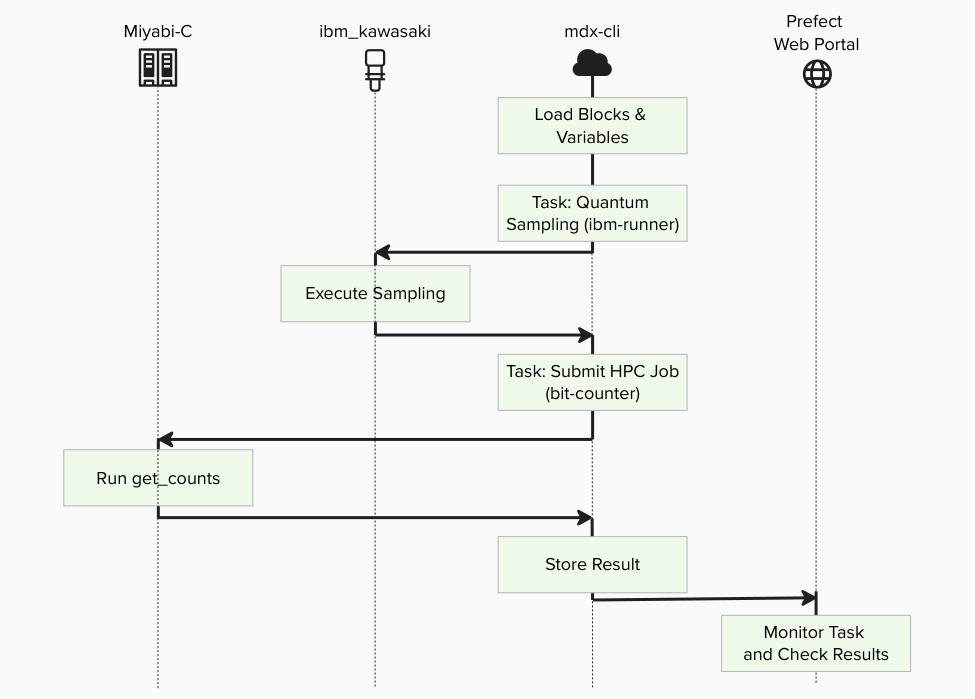
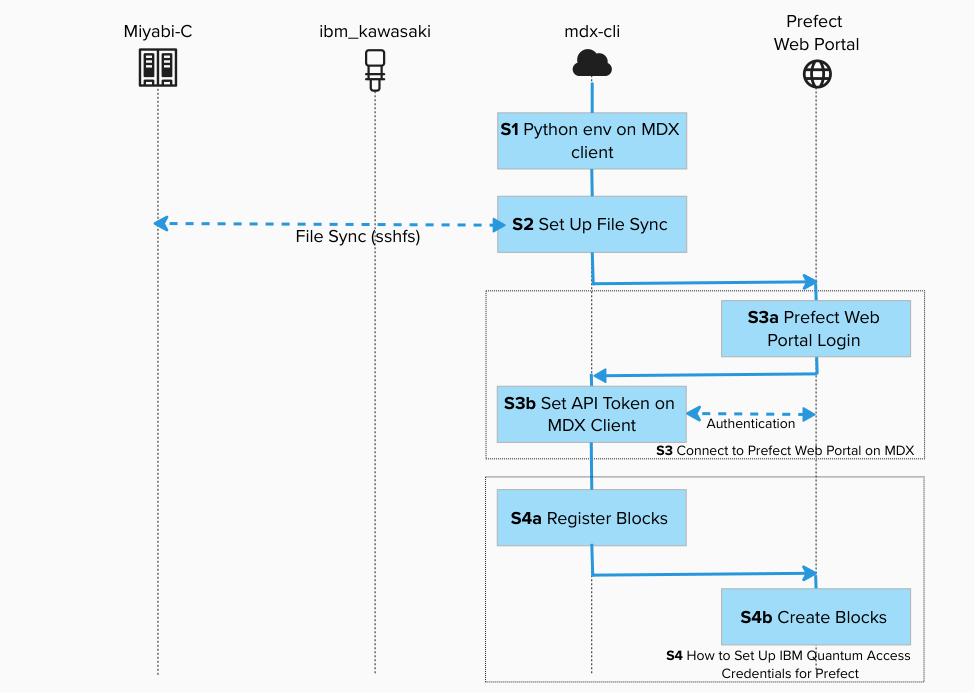
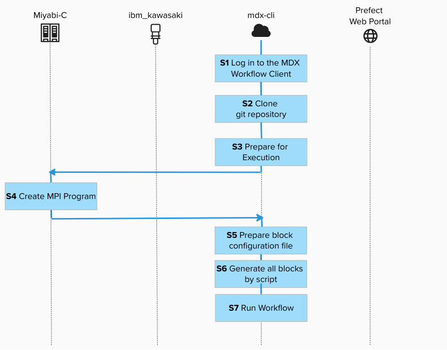
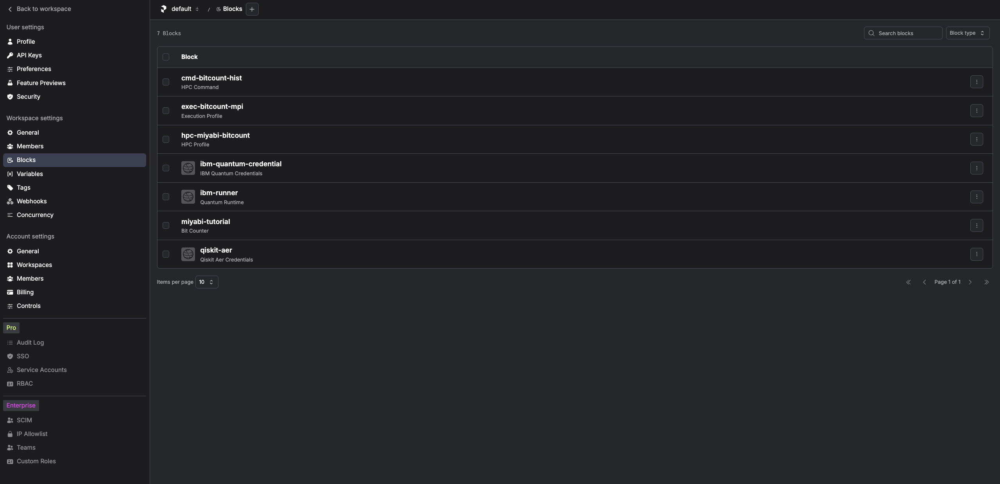
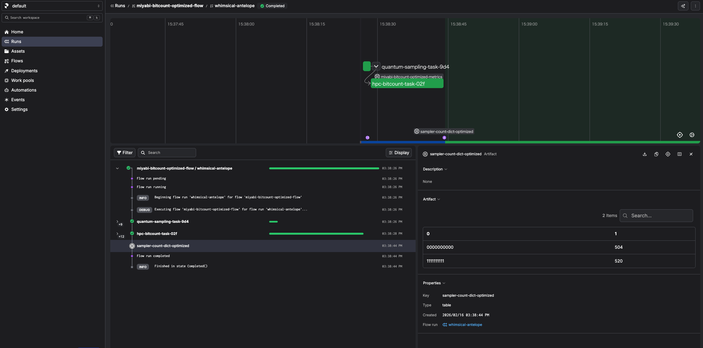

# Create Your QCSC Workflow with Prefect for Miyabi

This hands-on tutorial guides you through building a small C++ program on the Miyabi-C environment and integrating it into a Prefect workflow.
On the Prefect workflow, we also use [Prefect Qiskit](https://github.com/qiskit-community/prefect-qiskit) to show how to write a complete QCSC workflow from scratch.

Our objective is to compute a count dictionary of sampler bitstrings using MPI programming on the QCSC architecture.



Key principles in this tutorial:

- Users do not write new Python code for BitCount
- Blocks are not created manually in UI; they are generated by `create_blocks.py`
- Workflows run by specifying block names
- Existing tutorial assets can be migrated mainly by changing import lines

---


## Prefect Core Concepts (quick mapping with [Introduction to Prefect](./Prefect_tutorial_miyabi.pdf))

You will see these terms:
- **Flow**: the end-to-end workflow entrypoint
  - `examples/prefect_bitcount_demo/flow_optimized.py`
- **Task**: individual units executed inside a flow
  - Optimized flow task 1 (`quantum-sampling-task` in `flow_optimized.py`): quantum sampling and `input.bin` preparation
  - Optimized flow task 2 (`hpc-bitcount-task` in `flow_optimized.py`): HPC execution and count reconstruction
- **Block**: reusable server-side configuration stored in Prefect
  - `IBM Quantum Credentials` : IBM Cloud CRN + API key 
  - `QuantumRuntime` block: `ibm-runner` (pre-created)
  - `CommandBlock`: `cmd-bitcount-hist`
  - `ExecutionProfileBlock`: `exec-bitcount-mpi`
  - `HPCProfileBlock`: `hpc-miyabi-bitcount`
  - `BitCounter` block: `miyabi-tutorial` (legacy-style facade)
- **Variable**: server-side runtime parameters
  - `miyabi-bitcount-options` (optimized flow)


## What you need

- **Accounts / IDs**:
  - Common: (a) MDX/Miyabi-C account (+ OTP), (b) IBM Cloud API key + Service CRN (Quantum), (c) IBMid
  - Prefect backend (choose one): On-Prem Prefect account (MDX) or Prefect Cloud account/workspace
- **Local tools**: SSH client, an authenticator app (OTP), and a modern browser.  

## Choose your Prefect backend (On-Prem or Cloud)

This tutorial supports both backends. Choose one backend first, then use the same backend consistently for:

- opening the Web Portal
- creating blocks/variables (`create_blocks.py`)
- running the flow

| Item | On-Prem Prefect (MDX) | Prefect Cloud |
|---|---|---|
| Web Portal | Your organization-hosted Prefect UI | `https://app.prefect.cloud` |
| Authentication | SSO (often IBMid) | Prefect Cloud account + API key |
| CLI setup | `prefect-auth login` | `prefect cloud login --key <PREFECT_API_KEY>` |
| Scope of blocks/variables | Stored in on-prem workspace | Stored in selected cloud workspace |

## Identity & authentication checklist

Before the hands-on, confirm the identity mapping below. Mismatched emails are a common cause of access failures in enterprise/on-prem environments. 

| System | What you use to sign in | Must match other emails? (common policy) | Notes |
|---|---|---|---|
| Miyabi-C / HPC | HPC account + SSH key + OTP | No | Common for both backends |
| MDX workflow client| SSH to `mdx-workflow-host` | No | Common for both backends |
| Prefect (On-Prem) | SSO account (often IBMid) | Often YES (org policy) | Use your organization policy |
| Prefect Cloud | Prefect Cloud user + API key | Not required | On free tier, metadata retention is 7 days|
| IBM Quantum (IBM Cloud) | Service CRN + API key | No | Common for both backends |

> If you see SSO-related errors on the MDX Prefect console, first confirm that the email address used for SSO matches the Prefect user email required by your environment administrator.  


## Prerequisites (One-time setup)

This section prepares stable access from your laptop to MDX and from MDX to Miyabi-C. 
The whole process image is : 



Before starting, make sure:

- You have completed 
  - [Step1 : SSH Connection Setup for MDX and Miyabi-C with Git Configuration](../howto/howto_setup_ssh_keys_for_mdx_and_miyabi.md)
  - [Step1 : How to Set Up Python Environment on the MDX Workflow Client](../howto/howto_setup_python_env.md).
- You have completed [Step2 : How to Set Up File Sync Between MDX and Miyabi-C](../howto/howto_setup_file_sync.md).
- You have completed [Step3 : How to Connect to Prefect Web Portal on MDX](../howto/howto_connect_to_prefect_on_mdx.md).
- You have completed [Step4 : How to Set Up IBM Quantum Access Credentials for Prefect](../howto/howto_setup_prefect_qiskit.md).

> [!IMPORTANT]
> Replace `gz00` and `z12345` with your actual group and account name.


## Existing files used in this tutorial

- `../../examples/prefect_bitcount_demo/build_on_miyabi.sh`
- `../../examples/prefect_bitcount_demo/create_blocks.py`
- `../../examples/prefect_bitcount_demo/bitcount_blocks.example.toml`
- `../../examples/prefect_bitcount_demo/get_counts_integration.py`
- `../../examples/prefect_bitcount_demo/flow_optimized.py`
- `../../examples/prefect_bitcount_demo/flow_tutorial_style.py`

All steps below use these files as-is.

---

## Create BitCounts Workflow

## Step 1. Log in to the MDX Workflow Client

Connect to the MDX workflow client using SSH. This is where we will develop the workflow.

<br>
```bash
ssh -A z12345@mdx-workflow.example.org
```

## Step 2. Clone qcsc-prefect repository

If you haven't clone qcsc-prefect repository, please clone it.

<br>
```bash
cd /work/gz00/z12345
git clone git@github.com:hitomitak/qcsc-prefect.git
```

Activate your virtual environment for Prefect:

<br>
```bash
source ~/venv/prefect/bin/activate
```

Install necessary packages:

<br>
```bash
cd /work/gz00/z12345/qcsc-prefect
uv pip install prefect-qiskit
uv pip install --no-deps \
  -e packages/qcsc-prefect-core \
  -e packages/qcsc-prefect-adapters \
  -e packages/qcsc-prefect-blocks \
  -e packages/qcsc-prefect-executor
```

Check installations:

<br>
```bash
uv pip list | grep prefect
```

You should see output like:

```text
qcsc-prefect-adapters      0.1.0
qcsc-prefect-blocks        0.1.0
qcsc-prefect-core          0.1.0
qcsc-prefect-executor      0.1.0
prefect                   3.6.17
```

## Step 3. Prepare for Execution

Switch the prefect profile to `mdx`:

<br>
```bash
prefect profile use mdx
```

Update your prefect token (Only On Prem) if your token is expired.

<br>
```bash
prefect-auth login
/work/gz00/z12345/qcsc-prefect/scripts/prefect_sync_env_to_config.sh -p mdx
```


Make sure the Quantum Runtime block exist:

<br>
```bash
prefect block inspect quantum-runtime/ibm-runner
```

The output may look like:

```text
┌──────────────────────┬─────────────────────────────────────────────┐
│ Block Type           │ Quantum Runtime                             │
│ Block id             │ b2047dc9-e90e-4930-be6c-269478a4d6b4        │
├──────────────────────┼─────────────────────────────────────────────┤
│ resource_name        │ ibm_kawasaki                                │
│ execution_cache      │ True                                        │
│ enable_job_analytics │ True                                        │
│ credentials          │ {'crn':                                     │
│                      │ 'crn:v1:bluemix:public:quantum-computing:u… │
│                      │ 'api_key': '********'}                      │
└──────────────────────┴─────────────────────────────────────────────┘
```

## Step 4. Create MPI Program

Open a new terminal and connect to the Miyabi-C login node:

<br>
```bash
ssh -A z12345@miyabi-c.example.org
```

You will be prompted to enter a verification code. Open your authenticator app and input the OTP.

Create a directory:

<br>
```bash
cd /work/gz00/z12345/qcsc-prefect
./examples/prefect_bitcount_demo/build_on_miyabi.sh
```

Generated binaries:

- `examples/prefect_bitcount_demo/bin/get_counts_json`
- `examples/prefect_bitcount_demo/bin/get_counts_hist`

### Step 4.1. What `get_counts_json` and `get_counts_hist` do

Source code:

- `examples/prefect_bitcount_demo/src/get_counts_json.cpp`
- `examples/prefect_bitcount_demo/src/get_counts_hist.cpp`

Both programs implement the same core MPI bit-count pipeline:

1. Read `input.bin` (array of `uint32`) generated from sampler bitstrings.
2. Split data across MPI ranks.
3. Build local histograms for values in `[0, 2^BITLEN)` (`BITLEN=10` in this demo).
4. Reduce local histograms to rank 0 and write one output file.

Differences:

- `get_counts_json`
  - Uses `MPI_Scatter` (equal-size partition per rank).
  - Writes a human-readable sparse JSON file: `output.json`.
  - Useful for quick inspection and debugging.
- `get_counts_hist`
  - Uses `MPI_Scatterv` (handles non-even partition sizes).
  - Uses `uint64` counters and writes a fixed-size binary histogram: `hist_u64.bin`.
  - Preferred for larger workloads and used by default in this tutorial (`executable_key=bitcount_hist`).

---

## Step 5. Prepare block configuration file

Back to MDX termial, 

<br>
```bash
mkdir -p /work/gz00/z12345/miyabi_tutorial
cp examples/prefect_bitcount_demo/bitcount_blocks.example.toml \
   examples/prefect_bitcount_demo/bitcount_blocks.toml
vim examples/prefect_bitcount_demo/bitcount_blocks.toml
```

Set at least the following keys in `bitcount_blocks.toml`:

- `hpc_target = "miyabi"`
- `project`
- `queue`
- `work_dir` (base directory where each run creates a `job_xxxx` directory)

---

## Step 6. Generate all blocks by script

<br>
```bash
python examples/prefect_bitcount_demo/create_blocks.py \
  --config examples/prefect_bitcount_demo/bitcount_blocks.toml \
  --hpc-target miyabi
```

Optional CLI overrides:

<br>
```bash
python examples/prefect_bitcount_demo/create_blocks.py \
  --config examples/prefect_bitcount_demo/bitcount_blocks.toml \
  --hpc-target miyabi \
  --shots 200000 \
  --num-nodes 4 \
  --mpiprocs 8
```

### Step 6.1. What this script creates (default names)

| Type | Default name | Purpose |
|---|---|---|
| CommandBlock | `cmd-bitcount-hist` | Command definition (`executable_key=bitcount_hist`) |
| ExecutionProfileBlock | `exec-bitcount-mpi` | Nodes, MPI settings, walltime, modules |
| HPCProfileBlock | `hpc-miyabi-bitcount` | Miyabi queue/project/executable resolution |
| BitCounter Block | `miyabi-tutorial` | Backward-compatible facade |
| Prefect Variable | `miyabi-bitcount-options` | Sampler options + base `work_dir` for `flow_optimized.py` |
| Prefect Variable | `miyabi-tutorial` | Backward-compatible options name |

At this stage, users do not need to define block classes manually.



---

## Step 7A. Run workflow by specifying block names (recommended)

Use `flow_optimized.py` with block names as runtime parameters:

<br>
```bash
python examples/prefect_bitcount_demo/flow_optimized.py \
  --runtime-block ibm-runner \
  --command-block cmd-bitcount-hist \
  --execution-profile-block exec-bitcount-mpi \
  --hpc-profile-block hpc-miyabi-bitcount \
  --options-variable miyabi-bitcount-options
```

In this mode, the main user inputs are block names.

`flow_optimized.py` resolves the base work directory in this order:
1. `--work-dir` (if provided)
2. `work_dir` stored in `--options-variable`
3. fallback: `./work/prefect_bitcount_optimized`

We can also monitor the progress on the Prefect console:



### Step 7A.1. What `flow_optimized.py` does

Code location:

- `../../examples/prefect_bitcount_demo/flow_optimized.py`

This flow is an end-to-end implementation that connects quantum sampling and HPC bit counting
with two Prefect tasks.

Execution sequence:

1. **Task: `quantum-sampling-task`**
2. Load the Prefect `QuantumRuntime` block (default: `ibm-runner`).
3. Load sampler options (and optional `work_dir`) from a Prefect Variable (default: `miyabi-bitcount-options`).
4. Build a 10-qubit GHZ circuit, transpile it, and run `runtime.sampler(...)`.
5. Convert sampled bitstrings to `uint32` values and write `input.bin` in a per-run job directory.
6. **Task: `hpc-bitcount-task`**
7. Submit the HPC job via `run_job_from_blocks(...)` using:
   - `CommandBlock` (default: `cmd-bitcount-hist`)
   - `ExecutionProfileBlock` (default: `exec-bitcount-mpi`)
   - `HPCProfileBlock` (default: `hpc-miyabi-bitcount`)
8. Read `hist_u64.bin`, reconstruct the count dictionary, and publish a Prefect table artifact (`sampler-count-dict-optimized`).
9. Return a summary payload (`job_id`, total `shots`, `num_unique_bitstrings`, and `work_dir`).

Why this flow is recommended:

- Users only pass block/variable names as parameters.
- HPC submission details are encapsulated in blocks.
- The binary histogram path (`hist_u64.bin`) is efficient for larger shot counts.

---

## Step 7B. Run legacy tutorial-style workflow (`counter.get(bitstrings)`)

You can run `flow_tutorial_style.py` directly:

<br>
```bash
python examples/prefect_bitcount_demo/flow_tutorial_style.py
```

This flow uses `BitCounter.load("miyabi-tutorial")`.
`miyabi-tutorial` is already created in Step 6.

### Step 7B.1. Why old tutorial code still works

Compatibility is provided by the `BitCounter` facade block created by `create_blocks.py`.

What `create_blocks.py` prepares:

- `BitCounter` block: `miyabi-tutorial`
- `CommandBlock`: `cmd-bitcount-hist`
- `ExecutionProfileBlock`: `exec-bitcount-mpi`
- `HPCProfileBlock`: `hpc-miyabi-bitcount`
- Prefect Variable: `miyabi-tutorial` (sampler shots/options)

The `miyabi-tutorial` block stores references to the three execution blocks above
(`command_block_name`, `execution_profile_block_name`, `hpc_profile_block_name`)
plus `root_dir` and script settings.

Runtime path in legacy flow:

1. `flow_tutorial_style.py` loads:
   - `runtime = QuantumRuntime.load("ibm-runner")`
   - `counter = BitCounter.load("miyabi-tutorial")`
   - `options = Variable.get("miyabi-tutorial")`
2. Quantum sampling runs and produces `bitstrings`.
3. `counter.get(bitstrings)` calls the internal task in
   `get_counts_integration.py`:
   - writes `input.bin` under `root_dir/job_xxxx`
   - calls `run_job_from_blocks(...)` using the block names stored in `miyabi-tutorial`
4. The executor resolves those blocks and runs the same HPC pipeline as the optimized flow.
5. Result is read from `hist_u64.bin` (or `output.json` fallback), then returned as `counts`.

So the legacy API surface (`counter.get(bitstrings)`) stays unchanged, while
execution is delegated to the current block-based architecture.

You can inspect the facade block and referenced blocks:

<br>
```bash
prefect block inspect bit-counter/miyabi-tutorial
prefect block inspect hpc_command/cmd-bitcount-hist
prefect block inspect execution_profile/exec-bitcount-mpi
prefect block inspect hpc_profile/hpc-miyabi-bitcount
prefect block ls | rg "miyabi-tutorial|cmd-bitcount-hist|exec-bitcount-mpi|hpc-miyabi-bitcount"
```

---

## 8. Run previous tutorial assets by changing imports only

If you have code from previous `create_qcsc_workflow`-style tutorials
(`counter.get(bitstrings)` pattern), migration can be done mainly by replacing
import lines.

### Step 8.1. Replacement example

Old:

```python
from get_counts_integration import BitCounter
```

New (when running from `qcsc-prefect` root):

```python
from examples.prefect_bitcount_demo.get_counts_integration import BitCounter
```

If `BITLEN` is also used:

```python
from examples.prefect_bitcount_demo.get_counts_integration import BITLEN, BitCounter
```

---
