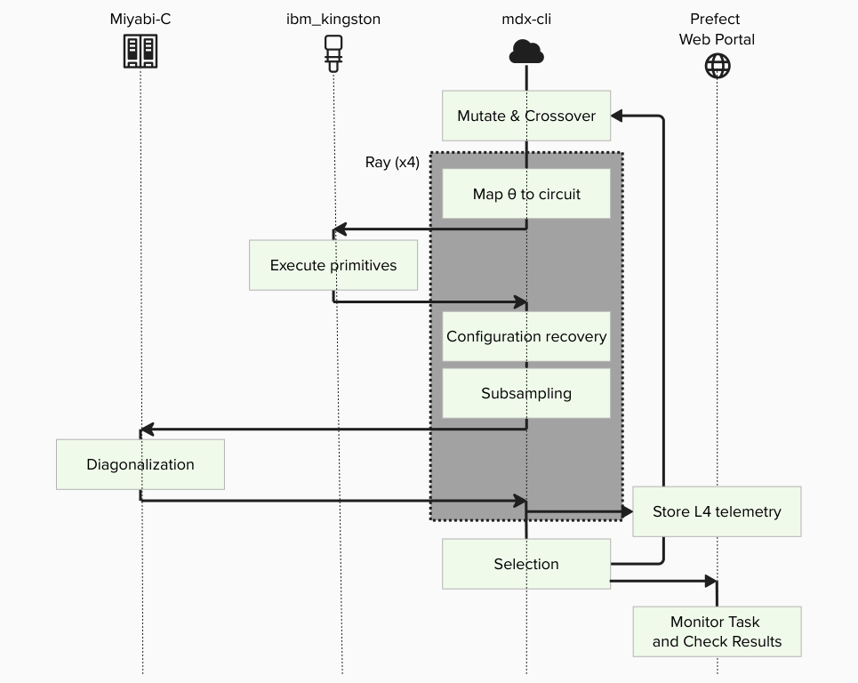
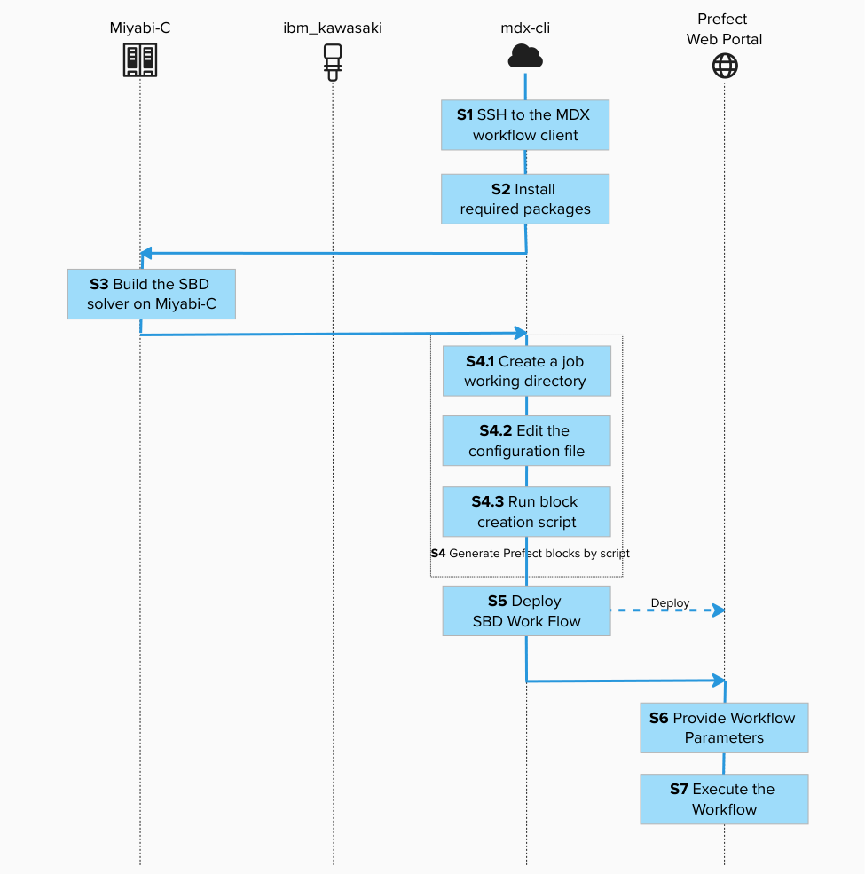

# Run SBD Closed-loop Workflow on Fugaku (hpc-prefect)

This tutorial walks us through reproducing a Sample-based Quantum Diagonalization (SQD) experiment using the `hpc-prefect` architecture.
We will run a hybrid quantum-classical workflow using the [SBD](https://github.com/r-ccs-cms/sbd) solver to diagonalize a sparse chemistry Hamiltonian on Fugaku, orchestrated via Prefect.

<br>

The goal is to compute the ground state energy of N2-MO state.

## Prerequisites

Before starting, make sure:

- You have completed [Create Your QCSC Workflow with Prefect for Fugaku](./create_qcsc_workflow_for_fugaku.md).
- You have completed [How to Set Up IBM Quantum Access Credentials for Prefect](../howto/howto_setup_prefect_qiskit.md).

> [!IMPORTANT]
> - Replace account, group, and project placeholders with your actual values.
> - Run this tutorial in an environment where both Prefect CLI and Fugaku scheduler commands (`pjsub`, `pjstat`) are available.

## 0. What changes from BitCounts?

### What you did in BitCounts (quick recap)
- **(HPC side)** Compile C++ and produce an executable.
- **(Prefect side)** Create blocks and variables.
- **(Flow side)** A Flow loads Blocks and Variables and runs tasks (quantum → HPC → post-process).

### What SBD closed-loop adds
- HPC execution expands from a single binary to full **SBD solver (`diag`) + closed-loop logic**.
- Additional Blocks are required (solver job block, etc.).
- **Deployment (Deploy)** becomes important so that participants can run from the Prefect UI reliably.
- Block creation is automated via script instead of manual UI editing.

---
## 1. Big picture: Flow / Task / Block / Variable / Deployment

### 1.1 Minimal "where it runs" model
- **Workflow host**: where the Prefect process runs the Flow (runner/worker side)
- **Fugaku**: where `diag` runs via PJM/MPI
- **IBM Quantum**: where quantum sampling runs via Qiskit Runtime

### 1.2 Mapping to Prefect core concepts

#### Flow (end-to-end experiment procedure)
The entire closed-loop SQD experiment is implemented as a single Flow, including iterations, branching, and convergence checks.

#### Tasks (individual steps)
- Execute quantum sampling (IBM Quantum / Qiskit Runtime)
- Subsampling / configuration recovery (Python)
- Davidson diagonalization (PJM job on Fugaku)
- Collect results and store artifacts (Prefect)

#### Blocks (reusable "configuration + credentials")
- **Quantum**: IBM Quantum credentials / runtime configuration
- **HPC**: SBD solver job settings (rscgrp, nodes, executable path, modules, etc.)
- **Command**: command execution settings
- **Execution Profile**: MPI execution settings

#### Variables (runtime parameters)
- Quantum sampler options (shots, etc.) and other run-time knobs are stored as Prefect Variables.

#### Deployment (how the Flow becomes runnable from the UI)
Deployment is the launch entry that tells Prefect:
- which Flow to run,
- under which deployment name,
- and how it should be executed by a serving process.

---
## 2. Tutorial steps
<br>

### Step 1. Enter your workflow environment

Connect to the environment where Prefect CLI is configured and Fugaku scheduler commands are available.

<br>
```bash
ssh -A <your_account>@<fugaku_login_host>
```

Activate the environment:

<br>
```bash
source ~/venv/prefect/bin/activate
```

### Step 2. Install required packages (bring the Flow definition into your environment)

<br>
```bash
cd /work/<group>/<user>/hpc-prefect

uv pip install --no-deps \
  -e packages/hpc-prefect-core \
  -e packages/hpc-prefect-adapters \
  -e packages/hpc-prefect-blocks \
  -e packages/hpc-prefect-executor

uv pip install -e algorithms/qcsc_workflow_utility
uv pip install -e algorithms/sbd
```

Check installation:

<br>
```bash
uv pip list | grep -E "(hpc-prefect|sbd|qcsc)"
```

---

### Step 3. Build the SBD solver on Fugaku (prepare the HPC executable)

Navigate to native source and build:

<br>
```bash
cd /work/<group>/<user>/hpc-prefect/algorithms/sbd/native
bash ./build_sbd_fugaku.sh
```

Confirm executable:

<br>
```bash
ls -l | grep diag
realpath ./diag
```

Example output:

```text
/work/<group>/<user>/hpc-prefect/algorithms/sbd/native/diag
```

We will use this path in the next step.

---

### Step 4. Generate Prefect blocks by script (Block Type vs Block Instance)

#### 4.1 Create a job working directory and copy config template

<br>
```bash
cd /work/<group>/<user>/hpc-prefect
mkdir -p /work/<group>/<user>/sbd_jobs
cp algorithms/sbd/sbd_blocks.example.toml algorithms/sbd/sbd_blocks.toml
```

If you use On-Prem Prefect, run login:

<br>
```bash
prefect-auth login
```

#### 4.2 Edit the configuration file

Edit `algorithms/sbd/sbd_blocks.toml` and set at least:

- `hpc_target = "fugaku"`
- `project`
- `queue`
- `work_dir`
- `sbd_executable`

| Parameter | Value / Example | Description |
|---|---|---|
| `hpc_target` | `fugaku` | Target scheduler backend |
| `project` | `hpXXXXXX` | Fugaku project |
| `queue` | `small` | Fugaku resource group (`rscgrp`) |
| `work_dir` | `/work/<group>/<user>/sbd_jobs` | Job working directory |
| `sbd_executable` | `/work/<group>/<user>/hpc-prefect/algorithms/sbd/native/diag` | Absolute path to executable |
| `launcher` | `mpiexec` | MPI launcher |
| `mpiprocs` | `8` | Number of MPI processes |
| `mpi_options` | `[]` or site-specific options | MPI options for launcher |
| `fugaku_gfscache` | `/vol0002` | Optional GFSCACHE setting |
| `fugaku_spack_modules` | site-specific list | Optional Spack modules |
| `fugaku_mpi_options_for_pjm` | site-specific list | Optional `#PJM --mpi` options |

#### 4.3 Run block creation script

<br>
```bash
python algorithms/sbd/create_blocks.py \
  --config algorithms/sbd/sbd_blocks.toml \
  --hpc-target fugaku
```

This creates the following blocks (default names):

- **CommandBlock**: `cmd-sbd-diag`
- **ExecutionProfileBlock**: `exec-sbd-fugaku`
- **HPCProfileBlock**: `hpc-fugaku-sbd`
- **SBD Solver Job**: `davidson-solver`
- **Prefect Variable**: `sqd_options`

---

### Step 5. Deploy SBD workflow

**Deploy = register a Flow as a runnable entry point (Deployment) so it can be started from the Prefect UI/CLI by name.**

Start a detached session:

<br>
```bash
screen -S sbd-workflow
```

Deploy:

<br>
```bash
cd /work/<group>/<user>/hpc-prefect
source ~/venv/prefect/bin/activate
sbd-deploy
```

Detach screen (`<ctrl> + a`, then `d`).

### Step 6. Provide workflow parameters

In the Prefect console, click **Run** → **Custom run** and set at least:

| Field | Value / Example |
|---|---|
| FCIDump File | `/work/<group>/<user>/hpc-prefect/algorithms/sbd/data/fcidump_N2_MO.txt` |
| SQD Subspace Dimension (Optional) | `10000000` (start small for testing) |
| Differential Evolution Iterations (Optional) | `1` (start small for testing) |
| Solver Block Ref | `sbd_solver_job/davidson-solver` |

<br>

### Step 7. Execute the workflow

Click **Start Now** → **Submit**.

<br>

After the run completes, check the `sqd-telemetry` artifact. It should contain intermediate energies.

<br>

### Step 8. Cleanup

Follow [How to shutdown the workflow](../howto/howto_shutdown_workflow.md).

---

## 3. What happens when you "Submit" from the Prefect UI?

### 3.1 What the UI actually creates
When you choose **Run → Custom run → Submit**, the Prefect server creates a **Flow Run request** for a specific Deployment, with the parameters you provided.

### 3.2 What actually executes the Flow
The process started by `sbd-deploy` is the **serving process**. It:
1. polls the Prefect server for new Flow Runs,
2. when it finds one, it executes the Flow on the host where `sbd-deploy` is running.

> If the serving process stops, the UI can still create Flow Runs, but there is no active runner to pick them up.

### 3.3 Confirm deployment information

1) List deployments
```bash
prefect deployment ls
```

2) Inspect deployment
```bash
prefect deployment inspect 'riken-sqd-de/riken_sqd_de'
```

3) Locate Flow definition

The flow is defined in `algorithms/sbd/sbd/main.py`.

### 3.4 What happens in this architecture

1. `walker_sqd` loads `SBDSolverJob` by name.
2. `SBDSolverJob.run(...)` prepares `fcidump.txt` and `AlphaDets.bin`.
3. Job is submitted by `run_job_from_blocks(...)` using:
   - `CommandBlock`
   - `ExecutionProfileBlock`
   - `HPCProfileBlock`
4. SBD output files (`davidson_energy.txt`, `occ_a.txt`, `occ_b.txt`, `carryover.bin`) are parsed.
5. Flow stores telemetry artifact (`sqd-telemetry`).

This keeps workflow code stable while HPC settings are controlled by block instances.

---

*END OF TUTORIAL*
