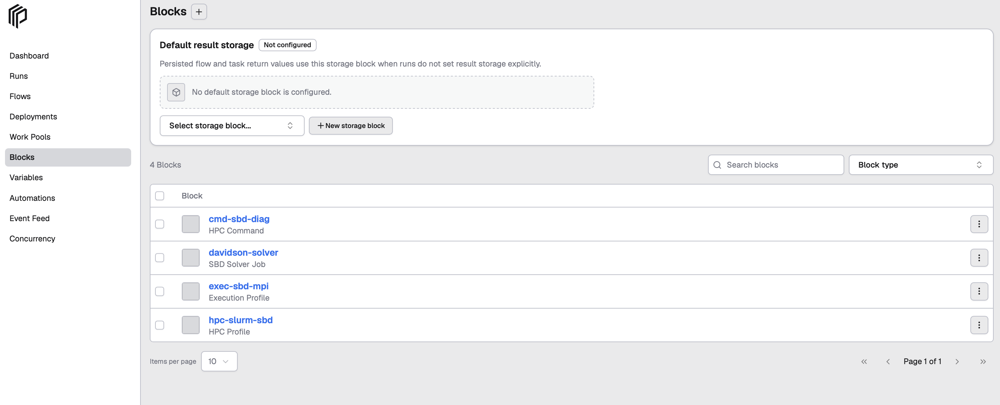
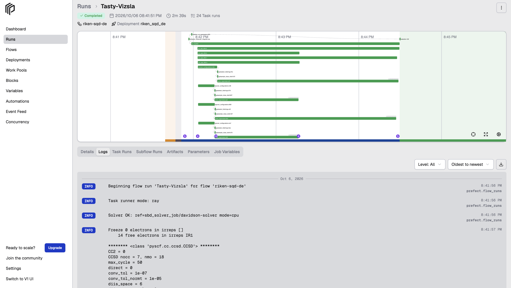
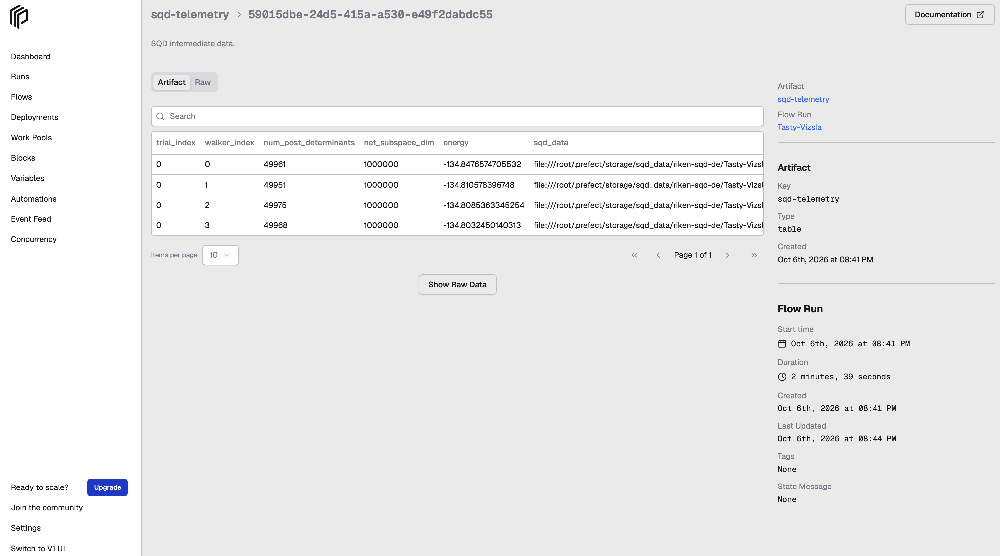

# Run SBD Closed-loop Workflow on Slurm (qcsc-prefect)

This tutorial demonstrates a Sample-based Quantum Diagonalization (SQD) workflow 
using the `qcsc-prefect` architecture.The workflow combines quantum sampling with 
classical processing and uses the [SBD](https://github.com/r-ccs-cms/sbd) solver to 
diagonalize a sparse chemistry Hamiltonian on a Slurm-based HPC system, 
with Prefect orchestrating the end-to-end workflow.

The tutorial focuses on running the workflow in a generic Slurm environment 
including building the SBD solver, configuring the Slurm execution environment 
and executing the hybrid quantum-classical workflow.

The goal is to compute the ground-state energy of the N2-Mo state while
demonstrating how the same QCSC workflow can target a generic Slurm
environment.

> **Tip**
>
> You can first validate the classical workflow and Slurm execution path
> by setting `Quantum Source` to `random`. This does not require IBM
> Quantum access.
>
> After the classical pipeline is working successfully, you can configure
> IBM Quantum access and rerun the workflow with `Quantum Source` set to
> `real-device`.


## Prerequisites

Before starting, make sure:

- You have access to a Slurm cluster with `sbatch` and `srun` available.
- Python 3.12 and `uv` are available on the Slurm login node.
- OpenBLAS and an MPI C++ compiler (`mpicxx` or `mpic++`) are available for building the SBD solver.
- IBM Quantum access is optional for the initial classical workflow test. If you plan to use a real quantum device, complete [How to Set Up IBM Quantum Access Credentials for Prefect on a Local Slurm Setup](../howto/howto_setup_prefect_qiskit_slurm.md).
------------------------------------------------------------------------

## 0. What changes for Slurm?

The workflow architecture remains the same across HPC backends. The main
difference is how the classical SBD solver is built, configured and
submitted.

The SBD solver uses the following reusable Blocks:

-   `CommandBlock` --- **what** executable to run.
-   `ExecutionProfileBlock` --- **how** to run it, including MPI
    launcher, process count, walltime, modules and related execution
    settings.
-   `HPCProfileBlock` --- **where** to run it, including the HPC target,
    partition/queue, and project/account.
-   `SBDSolverJob` --- the SBD-specific wrapper that references the
    three Blocks above and stores solver-specific parameters.

For a Slurm target, `qcsc-prefect` generates a Slurm batch script and
submits the SBD computation through Slurm.

------------------------------------------------------------------------

## 1. Big picture: where the workflow runs

A typical Slurm setup contains three execution contexts:

-   **Workflow environment** --- runs the Prefect Flow and Python
    workflow logic.
-   **Slurm compute nodes** --- execute the compiled SBD `diag` binary.
-   **IBM Quantum** --- executes quantum sampling when
    `quantum_source="real-device"` is selected.

On systems where the workflow environment and Slurm login environment
are the same machine or share the same filesystem, the repository and
SBD executable can be accessed directly.

### Prefect concepts used by the workflow

#### Flow

The complete SQD experiment is represented as a Prefect Flow, including
quantum sampling, configuration recovery, SBD diagonalization,
iterations and result collection.

#### Tasks

Individual stages include:

-   quantum sampling
-   subsampling/configuration recovery
-   Davidson diagonalization on Slurm
-   result collection and artifact generation

#### Blocks

Blocks store reusable configuration such as:

-   quantum credentials/runtime configuration
-   executable path
-   MPI execution settings
-   Slurm partition/account settings
-   SBD solver parameters

#### Variables

Runtime options such as quantum sampler settings can be stored as
Prefect Variables.

#### Deployment

A deployment makes the Flow runnable by name from the Prefect UI or CLI.

------------------------------------------------------------------------

## 2. Tutorial steps

### Step 1. Set up the repository and Python environment

If you completed the IBM Quantum access prerequisite, navigate to the existing `qcsc-prefect` checkout and activate the Python environment:

```bash
cd /path/to/qcsc-prefect
source .venv/bin/activate
```

Otherwise, clone the `qcsc-prefect` repository:

```bash
git clone https://github.com/qiskit-community/qcsc-prefect.git
cd qcsc-prefect
```

Create and activate a Python 3.12 virtual environment:

```bash
uv venv -p 3.12
source .venv/bin/activate
```

------------------------------------------------------------------------

### Step 2. Install the required packages

From the repository root, install the local packages:

``` bash
uv pip install --no-deps \
  -e packages/qcsc-prefect-core \
  -e packages/qcsc-prefect-adapters \
  -e packages/qcsc-prefect-blocks \
  -e packages/qcsc-prefect-executor
```

Install the workflow utility and SBD packages:

``` bash
uv pip install -e algorithms/qcsc_workflow_utility
uv pip install -e algorithms/sbd
```

Check the installation:

``` bash
uv pip list | grep -E "(qcsc-prefect|sbd|qcsc)"
```

------------------------------------------------------------------------

### Step 3. Build the SBD solver for the Slurm environment

The SBD solver is a native C++ executable. Build it in an environment
compatible with the Slurm compute nodes where it will run.

Navigate to the native solver directory:

``` bash
cd algorithms/sbd/native
```

Run the Slurm build script:

``` bash
bash build_sbd_slurm.sh
```

The script:

1.  selects `mpicxx` or `mpic++`,
2.  clones the upstream SBD repository if needed,
3.  checks out the SBD revision used by this integration,
4.  compiles `main.cc` with C++17, OpenMP, and optimization enabled,
5.  links the executable against OpenBLAS.

The upstream SBD revision is pinned by the build script so that the
build is reproducible.

After a successful build, you should see output similar to:

``` text
Build completed: /path/to/qcsc-prefect/algorithms/sbd/native/diag
```

Verify the executable:

``` bash
ls -lh diag
file diag
```

Record its absolute path:

``` bash
realpath diag
```

You will use this path as `sbd_executable` in the Slurm configuration.

> **Note**
>
> The default build expects OpenBLAS to be available through
> `-lopenblas`. Cluster-specific compiler or CPU optimization flags can
> be added when appropriate, but the portable build should be tested
> first.

------------------------------------------------------------------------

### Step 4. Create the Slurm SBD configuration

Return to the repository root:

``` bash
cd /path/to/qcsc-prefect
```

Create a working directory for SBD jobs. The directory must be
accessible from the Slurm compute nodes.

For example:

``` bash
mkdir -p /path/to/sbd_jobs
```

Copy the Slurm example configuration to create your local configuration:

``` bash
cp /path/to/qcsc-prefect/algorithms/sbd/sbd_blocks.slurm.example.toml \
   /path/to/qcsc-prefect/algorithms/sbd/sbd_blocks.toml
```

Edit the local configuration:

``` bash
vim /path/to/qcsc-prefect/algorithms/sbd/sbd_blocks.toml
```

At minimum, configure:

| Parameter | Example | Description |
|---|---|---|
| `hpc_target` | `"slurm"` | Selects the Slurm backend |
| `project` | `"default"` | Slurm account/project, if required |
| `queue` | `"normal"` | Slurm partition |
| `work_dir` | `"/path/to/sbd_jobs"` | Shared job working directory |
| `sbd_executable` | `"/path/to/qcsc-prefect/algorithms/sbd/native/diag"` | Absolute path to the compiled solver |

A minimal configuration looks like:

``` toml
hpc_target = "slurm"
project = "default"
queue = "normal"
work_dir = "/path/to/sbd_jobs"
sbd_executable = "/path/to/qcsc-prefect/algorithms/sbd/native/diag"

launcher = "srun"
walltime = "00:15:00"
num_nodes = 1
mpiprocs = 8
modules = []
mpi_options = []
```

The example configuration also exposes SBD solver parameters:

``` toml
task_comm_size = 1
adet_comm_size = 1
bdet_comm_size = 1

block = 4
iteration = 1
tolerance = 0.01
carryover_ratio = 0.1
solver_mode = "cpu"
```

For a quick functional test, the low-iteration settings in the example
configuration are recommended before scaling the calculation.

------------------------------------------------------------------------

### Step 5. Generate the Prefect Blocks

#### Optional: Run a Prefect server on the login node

Before creating the Prefect blocks, make sure your Prefect client is connected to a running Prefect server.

For a small or tutorial environment, you can run the Prefect server directly on the Slurm login node:

```bash
prefect server start --host 0.0.0.0 --background
```

Configure the Prefect client to use this server:

```bash
prefect config set PREFECT_API_URL=http://127.0.0.1:4200/api
```

Verify that the server is accessible:

```bash
prefect server status
```

This setup is convenient for a single-user tutorial or test environment. For a shared or production environment, use the Prefect deployment appropriate for your infrastructure.

#### Create the Prefect blocks

Run the block creation script using the Slurm configuration:

``` bash
python /path/to/qcsc-prefect/algorithms/sbd/create_blocks.py --config /path/to/qcsc-prefect/algorithms/sbd/sbd_blocks.toml
```

The script creates the reusable configuration needed by `SBDSolverJob`,
including:

-   a `CommandBlock` for the `diag` executable,
-   an `ExecutionProfileBlock` for MPI/Slurm execution,
-   an `HPCProfileBlock` with `hpc_target="slurm"`,
-   an `SBDSolverJob`,
-   the SQD runtime options Variable.

If you use the block-name overrides shown in the Slurm example
configuration, the resulting names are:

``` text
CommandBlock:          cmd-sbd-diag
ExecutionProfileBlock: exec-sbd-mpi
HPCProfileBlock:       hpc-slurm-sbd
SBD Solver Job:        davidson-solver
Prefect Variable:      sqd_options
```

The `davidson-solver` Block is the workflow-facing solver preset.
Internally, it references the command, execution profile, and HPC
profile Blocks.

You can inspect the registered Blocks with Prefect:

``` bash
prefect block ls
```
The output should include the following blocks:

```text
                                                    Blocks
┏━━━━━━━━━━━━━━━━━━━━━━━━━━━━━━━━━━━━━━┳━━━━━━━━━━━━━━━━━━━┳━━━━━━━━━━━━━━━━━┳━━━━━━━━━━━━━━━━━━━━━━━━━━━━━━━━┓
┃ ID                                   ┃ Type              ┃ Name            ┃ Slug                           ┃
┡━━━━━━━━━━━━━━━━━━━━━━━━━━━━━━━━━━━━━━╇━━━━━━━━━━━━━━━━━━━╇━━━━━━━━━━━━━━━━━╇━━━━━━━━━━━━━━━━━━━━━━━━━━━━━━━━┩
│ <block-id>                           │ Execution Profile │ exec-sbd-mpi    │ execution-profile/exec-sbd-mpi │
│ <block-id>                           │ HPC Command       │ cmd-sbd-diag    │ hpc-command/cmd-sbd-diag       │
│ <block-id>                           │ HPC Profile       │ hpc-slurm-sbd   │ hpc-profile/hpc-slurm-sbd      │
│ <block-id>                           │ SBD Solver Job    │ davidson-solver │ sbd-solver-job/davidson-solver │
└──────────────────────────────────────┴───────────────────┴─────────────────┴────────────────────────────────┘

```

You can also verify the generated blocks from the Prefect UI:




------------------------------------------------------------------------

### Step 6. Deploy the SBD workflow


For a long-running deployment, use a process-management mechanism appropriate for your environment such as `screen`, `tmux` or a service.

For example, from the repository root, activate the Python environment and start the SBD deployment using `screen`:

```bash
cd /path/to/qcsc-prefect
source /path/to/venv/bin/activate

screen -S sbd-workflow
sbd-deploy
```

When the deployment starts successfully, you should see output similar to:

```text
Your flow 'riken-sqd-de' is being served and polling for scheduled runs!

To trigger a run for this flow, use the following command:

    $ prefect deployment run 'riken-sqd-de/riken_sqd_de'

You can also run your flow via the Prefect UI.
```

At this point, the deployment is ready to accept flow runs. Keep the serving process running while executing the workflow.

To detach from the `screen` session while leaving the deployment running, press `Ctrl+A`, followed by `D`.

The serving process must remain active so that it can pick up Flow Runs created from the Prefect UI or CLI.

List deployments with:

``` bash
prefect deployment ls
```

The output should include the SBD workflow deployment:

```text
Deployments
┏━━━━━━━━━━━━━━━━━━━━━━━━━━━━━━━┳━━━━━━━━━━━━━━━━━━━━━━━━━━━━━━━━━━━━━━┳━━━━━━━━━━━┓
┃ Name                          ┃ ID                                   ┃ Work Pool ┃
┡━━━━━━━━━━━━━━━━━━━━━━━━━━━━━━━╇━━━━━━━━━━━━━━━━━━━━━━━━━━━━━━━━━━━━━━╇━━━━━━━━━━━┩
│ riken-sqd-de/riken_sqd_de     │ <deployment-id>                      │           │
└───────────────────────────────┴──────────────────────────────────────┴───────────┘
```

This confirms that the `riken-sqd-de/riken_sqd_de` deployment was created successfully and is available to run.

------------------------------------------------------------------------

### Step 7. Provide workflow parameters

From the Prefect UI, select the SBD deployment and choose **Run → Custom
run**.

For an initial test, use parameters similar to:

| Field | Value / Example |
|---|---|
| FCIDump File | `/path/to/qcsc-prefect/algorithms/sbd/data/fcidump_N2_MO.txt` |
| SQD Subspace Dimension | `1000000` |
| Differential Evolution Iterations | `1` |
| Quantum Source | `random` or `real-device` |
| Random Seed | `24` |
| Solver Block Ref | `sbd_solver_job/davidson-solver` |

`Solver Block Ref` selects the `SBDSolverJob` preset used by the
workflow.

For the initial Slurm integration test, use `random` to validate the classical workflow and Slurm execution path without requiring access to a quantum device.

After validating the Slurm execution path, use `real-device` to run the sampling workload on IBM Quantum using the configured quantum runtime block.

------------------------------------------------------------------------

### Step 8. Execute and monitor the workflow


After configuring the workflow parameters, click **Start Now → Submit** in the Prefect UI.

The submitted flow run can be monitored from the Prefect UI. During execution, the workflow runs the classical SQD stages and submits the SBD diagonalization job to the configured Slurm cluster.



*Execution of the SBD closed-loop workflow from the Prefect UI.*

You can also monitor the submitted Slurm job from the login node:

```bash
squeue -u "$USER"
```

After the workflow completes, open the `sqd-telemetry` artifact in the Prefect UI to inspect the intermediate energies and workflow results.



*SQD telemetry generated after successful workflow execution.*

The `sqd-telemetry` artifact records the energy computed for each walker across differential evolution trials. With the fast tutorial configuration (`iteration = 1`), only `trial_index = 0` is expected. Increase `iteration` to run additional trials and observe energy convergence.

------------------------------------------------------------------------

## 3. How the Slurm execution works

The Slurm execution path keeps the scientific workflow independent of
cluster-specific scheduler configuration.

At runtime:

1.  The workflow loads the selected `SBDSolverJob`.
2.  `SBDSolverJob` resolves its `CommandBlock`, `ExecutionProfileBlock`,
    and `HPCProfileBlock`.
3.  The solver prepares files such as `fcidump.txt` and `AlphaDets.bin`.
4.  The executor resolves `hpc_target="slurm"`.
5.  A Slurm job request is constructed from the reusable Blocks.
6.  The Slurm adapter renders the `.slurm` batch script.
7.  The job is submitted to the configured partition/account.
8.  The workflow waits for the scheduler job to reach a final state.
9.  SBD output files are parsed and returned to the workflow.
10. Prefect stores the resulting SQD telemetry.

This separation allows the workflow logic to remain stable while
scheduler-specific settings are controlled through configuration and
Prefect Blocks.

------------------------------------------------------------------------

## 4. Troubleshooting

### `diag` does not exist

Rebuild the native solver:

``` bash
cd algorithms/sbd/native
bash build_sbd_slurm.sh
```

Then verify:

``` bash
ls -lh diag
file diag
```

### OpenBLAS cannot be linked

Verify that the OpenBLAS development package is installed and that the
linker can resolve:

``` text
-lopenblas
```

The exact installation procedure depends on the operating system and
cluster software environment.

### `sbatch` or `srun` is unavailable

The workflow must execute in an environment with access to the Slurm
client commands used to submit and monitor jobs.

Check:

``` bash
which sbatch
which srun
sinfo
```

### Slurm rejects the partition or account

Verify the values configured as:

``` toml
project = "..."
queue = "..."
```

These map to the Slurm account/project and partition used by the
generated batch job.

### The executable exists on the login node but fails on the compute node

Ensure that:

-   `sbd_executable` uses an absolute path,
-   the filesystem is mounted on the compute nodes,
-   the executable has execute permission,
-   required dynamic libraries are available on the compute nodes.

### Prefect cannot find the solver Block

Check the configured Prefect profile/server:

``` bash
prefect profile ls
prefect config view
prefect block ls
```

Then recreate the Blocks if necessary:

``` bash
python algorithms/sbd/create_blocks.py \
  --config algorithms/sbd/sbd_blocks.toml
```

------------------------------------------------------------------------

## 5. Recommended validation sequence

Before scaling the SQD calculation or enabling a real quantum device,
validate the Slurm integration in stages:

1.  Build `diag` successfully.
2.  Confirm the executable runs on the target Slurm compute environment.
3.  Create the Slurm Prefect Blocks.
4.  Run the workflow with a small SQD subspace and
    `quantum_source="random"`.
5.  Confirm Slurm submission, job completion and SBD result parsing.
6.  Inspect the Prefect telemetry artifact.
7.  Enable `quantum_source="real-device"` after the classical Slurm path
    is working.
8.  Increase SQD/solver parameters only after the end-to-end workflow is
    stable.

This staged approach separates scheduler/build problems from
quantum-access problems and makes the integration easier to debug.

------------------------------------------------------------------------

END OF TUTORIAL
