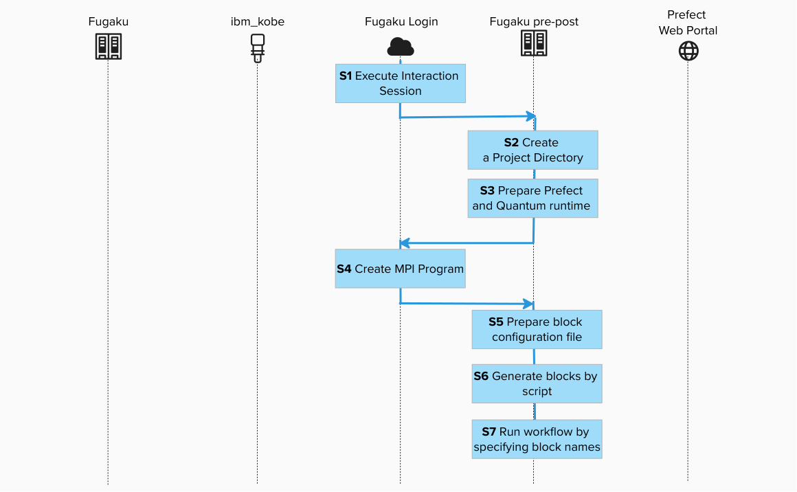
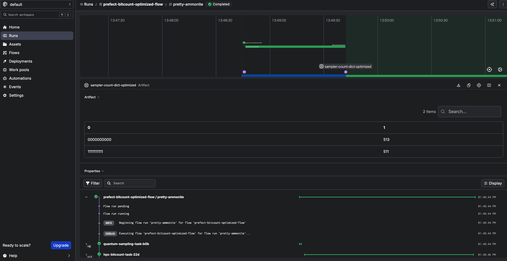

# Create Your QCSC Workflow with Prefect

This hands-on tutorial guides you through building a small C++ program on the Fugaku environment and integrating it into a Prefect workflow using a custom `FugakuJobBlock` class.
On the Prefect workflow, we also use [Prefect Qiskit](https://github.com/qiskit-community/prefect-qiskit) to show how to write a complete QCSC workflow from scratch.

Our objective is to compute a count dictionary of sampler bitstrings using MPI programming on the QCSC architecture.


## Prefect Core Concepts (quick mapping with [Introduction to Prefect](./Prefect_tutorial_miyabi.pdf))

You will see these terms:
- **Flow**: the end-to-end workflow defined in sampler_workflow.py
- **Task**: individual steps inside the flow (e.g., runtime.sampler(...), counter.get(...))
- **Block**: reusable configuration + credentials stored in Prefect server
  - `ibm-quantum-credentials` : IBM Cloud CRN + API key
  - `quantum-runtime` : runtime settings referencing credentials
  - `bit-counter` : HPC job configuration (queue, nodes, executable path, modules)
- **Variable**: run-time parameter stored server-side (sampler shots etc.)

## What you need

- **Accounts / IDs**: (a) Fugaku account, (b) Prefect Web Portal account (API Key), (c) IBM Cloud API key + Service CRN (Quantum)
- **Local tools**: SSH client and a modern browser.

---
## Prerequisites (One-time setup)

The whole process image is :


Before starting, make sure:

- You have completed [Step1 : How to Set Up Python Environment on Fugaku Pre/Post Node](../howto/howto_setup_python_env_fugaku.md).
- You have completed [Step2 : How to Set Up IBM Quantum Access Credentials for Prefect](../howto/howto_setup_prefect_qiskit_fugaku.md).

> [!IMPORTANT]
> Replace `ra00000`, `u12345` and `vol0000x` with your actual group, account name and mount volume.
---
## Create BitCounts Workflow


## Step 1: Log in to Fugaku and execute the interact session for Pre/Post Node

Execute the interact session for Pre/Post Node in the login node.

<br>
```bash
srun -p mem2 -n 1 --mem 4G --time=60 --pty bash -i
```

## Step 2. Create a Project Directory (Pre/Post Node)

Create a project directory:

<br>
```bash
mkdir fugaku_tutorial && cd fugaku_tutorial
```

Activate a virtual environment and activate for prefect:

<br>
```bash
source ~/venv/prefect/bin/activate
```

Install necessary packages:

<br>
```bash
uv pip install git+ssh://git@github.com/hitomitak/prefect-fugaku.git@main#subdirectory=framework/prefect-fugaku
```

Check installations:

<br>
```bash
uv pip list | grep prefect
```

You should see output like:

```text
prefect                   3.4.20
prefect-fugaku            0.1.0
prefect-qiskit            0.2.0
```

## Step 3: Execute the interact session for Compute Node (Login Node)

Open a new terminal and connect to the login node and execute the interactive session for Compute node.

<br>
```bash
pjsub --interact -g ra00000 -L "node=1" -L "rscgrp=int" -L "elapse=0:15:00" --sparam "wait-time=600" -x PJM_LLIO_GFSCACHE=/vol0004:/vol000x --no-check-directory --llio cn-read-cache=off --mpi "max-proc-per-node=1"
```

## Step 4. Create MPI Program (Compute Node)
Change directory and open a C++ source code file:

<br>
```bash
cd fugaku_tutorial
vi get_counts.cpp
```

Add following lines to the file:

```c++
#include <mpi.h>
#include <fstream>
#include <vector>
#include <iostream>

const uint32_t BITLEN = 10;
const uint32_t MAXVAL = 1 << BITLEN;

int main(int argc, char** argv) {
    MPI_Init(&argc, &argv);

    int rank, size;
    MPI_Comm_rank(MPI_COMM_WORLD, &rank);
    MPI_Comm_size(MPI_COMM_WORLD, &size);

    uint32_t total_count = 0;
    std::vector<uint32_t> data;

    if (rank == 0) {
        std::ifstream fin("input.bin", std::ios::binary | std::ios::ate);
        total_count = fin.tellg() / sizeof(uint32_t);
        fin.seekg(0, std::ios::beg);

        data.resize(total_count);
        fin.read(reinterpret_cast<char*>(data.data()), total_count * sizeof(uint32_t));
        fin.close();
    }

    MPI_Bcast(&total_count, 1, MPI_UNSIGNED, 0, MPI_COMM_WORLD);

    uint32_t local_n = total_count / size;
    std::vector<uint32_t> local_data(local_n);

    MPI_Scatter(rank == 0 ? data.data() : nullptr, local_n, MPI_UNSIGNED,
                local_data.data(), local_n, MPI_UNSIGNED,
                0, MPI_COMM_WORLD);

    std::vector<int> local_hist(MAXVAL, 0);
    for (auto v : local_data) {
        if (v < MAXVAL) local_hist[v]++;
    }

    std::vector<int> global_hist;
    if (rank == 0) global_hist.resize(MAXVAL, 0);

    MPI_Reduce(local_hist.data(),
               rank == 0 ? global_hist.data() : nullptr,
               MAXVAL, MPI_INT, MPI_SUM, 0, MPI_COMM_WORLD);

    if (rank == 0) {
        std::ofstream fout("output.json");
        fout << "{";
        bool first = true;
        for (uint32_t i = 0; i < MAXVAL; ++i) {
            if (global_hist[i] > 0) {
                if (!first) fout << ",";
                fout << "\"" << i << "\":" << global_hist[i];
                first = false;
            }
        }
        fout << "}\n";
        fout.close();
    }

    MPI_Finalize();
    return 0;
}
```

> [!NOTE]
> This program reads the `input.bin` file including a 32-bit integer vector of bitstrings, splits the data across MPI processes, and counts how often each value appears.
> Each process builds a local histgram from its share of the data.
> MPI then combines all local results into a single global histogram, which rank 0 writes out as `output.json`.

Load Fujutsu MPI library in your shell:

<br>
```bash
. /vol0004/apps/oss/spack/share/spack/setup-env.sh
spack load fujitsu-mpi@head-gcc8
```

Compile the program.

<br>
```bash
mpiFCC get_counts.cpp -o get_counts
```

Check the output file:

<br>
```bash
ls -l
```

Example output:

```text
-rwxr-x--- 1 u12345 ra0000 63872 Sep 30 10:59 get_counts
-rw-r----- 1 u12345 ra0000  1841 Sep 30 10:57 get_counts.cpp
```

Get the absolute path to the `get_counts` executable:

<br>
```bash
realpath ./get_counts
```

Example output:

```text
/vol000x/mdt6/data/ra00000/u12345/fugaku_tutorial/get_counts
```

We will need this path in the later step.

## Step 5. Configure the HPC execution block (Block)

Instead of writing a Python binding (pybind), we write a Prefect block to run the get_counts executable:

### Step 5.1. Define `bit-counter` block type (Pre/Post)
In this step, we define a Block Type (“bit-counter”) in Python.
This is the template/schema that tells Prefect what fields the block has and how it runs get_counts on HPC.

Back to the shell for the Pre/Post Node.
In the project directory (`~/fugaku_tutorial`), open a new Python file:

<br>
```bash
vi get_counts_integration.py
```

Add following lines to the file:

```python
import json
import numpy as np
from prefect import task
from prefect_fugaku import FugakuJobBlock

BITLEN = 10

class BitCounter(FugakuJobBlock):

    _block_type_name = "Bit Counter"
    _block_type_slug = "bit-counter"

    async def get(
        self,
        bitstrings: list[str],
    ) -> dict[str, int]:
        return await get_inner(self, bitstrings)

@task(name="get_counts_mpi")
async def get_inner(
    job: BitCounter,
    bitstrings: list[str],
) -> dict[str, int]:
    with job.get_executor() as executor:
        # Write file
        u32int_array = np.array(
            [int(b, base=2) for b in bitstrings],
            dtype=np.uint32,
        )
        u32int_array.tofile(executor.work_dir / "input.bin")
        # Run MPI program
        exit_code = await executor.execute_job(**job.get_job_variables())
        # Read file
        with open(executor.work_dir / "output.json", "r") as f:
            int_counts = json.load(f)
    return {format(int(k), f"0{BITLEN}b"): v for k, v in int_counts.items()}
```

<br>
```bash
prefect block register -f get_counts_integration.py
```

### Step 5.2. Create `bit-counter` block instance (Pre/Post)
In this step, we create a Block Instance (e.g., “fugaku-tutorial”).
This is your environment-specific configuration, such as queue name, node count, and the executable path.
Create a new configuration for the Bit Counter block:

Create a new configuration for the Bit Counter block:

<br>
```bash
prefect block create bit-counter
```

This command will display a URL to the Prefect console.
Open it in your browser and fill in the following fields:

| Field | Value / Example |
|---|---|
| Block Name | `fugaku-tutorial` |
| Executor | `pjm`|
| GFSCACHE Volume | `/vol0004:/vol000x` |
| Launcher | `mpiexec` |
| Num MPI Processes | `2` |
| Num Nodes | `2` |
| Root Directory | `/vol000x/mdt6/data/ra000000/u12345/fugaku_tutorial` <br> (The path to the `fugaku_tutorial` directory in Fugaku)|
| Executable | `/vol0000/mdt6/data/ra000000/u12345/fugaku_tutorial/get_counts` <br> (The absolute path to the `get_counts` executable)|
| group_name| `ra000000` (Your Fugaku group name) |
| Max Elapse Time| `00:05:00`|
| MPI Options| `["-n", "2"]`|
| Load Spack Modules| `["fujitsu-mpi@head-gcc8"]`|
| Resource Group | `small`|
| MPI Options for PJM | `["max-proc-per-node=1"]` |

## Step 6. Create Prefect Workflow (Pre/Post)

Next, in the same directory, create a separate Python file to define the Prefect workflow.
This script may look like a regular Qiskit pattern, namely, create a `QuantumCircuit`, make a PUB (Primitive
Unified Bloc) with it, and run the sampler primitive. Then, postprocess the result data and save it in some filesystem
(in this case, we use the Prefect server storage). You might not even realize it’s using HPC just by looking at the
workflow code.

<br>
```bash
vi sampler_workflow.py
```

Add following lines to the file:

```python
import asyncio
from prefect import flow
from prefect.artifacts import create_table_artifact
from prefect.variables import Variable
from prefect_qiskit import QuantumRuntime
from qiskit import QuantumCircuit
from qiskit.transpiler import generate_preset_pass_manager
from get_counts_integration import BitCounter

BITLEN = 10

@flow(name="fugaku_tutorial")
async def main():
    # Load configurations
    runtime = await QuantumRuntime.load("ibm-runner")
    counter = await BitCounter.load("fugaku-tutorial")
    options = await Variable.get("fugaku-tutorial")
    # Create a PUB payload
    target = await runtime.get_target()
    qc_ghz = QuantumCircuit(BITLEN)
    qc_ghz.h(0)
    qc_ghz.cx(0, range(1, BITLEN))
    qc_ghz.measure_active()
    pm = generate_preset_pass_manager(
        optimization_level=3,
        target=target,
        seed_transpiler=123,
    )
    isa = pm.run(qc_ghz)
    pub_like = (isa, )
    # Execute
    results = await runtime.sampler([pub_like], options=options)
    bitstrings = results[0].data.meas.get_bitstrings()
    counts = await counter.get(bitstrings)
    # Save in Prefect artifacts
    await create_table_artifact(
        table=[list(counts.keys()), list(counts.values())],
        key="sampler-count-dict",
    )

if __name__ == "__main__":
    asyncio.run(main())
```

## Step 7. Execute the Workflow (Pre/Post Node)

To execute the workflow, run the following Python script:

<br>
```bash
python sampler_workflow.py
```

We can also monitor the progress on the Prefect console:



Upon successful completion of the workflow, Prefect will generate the following artifacts:

- `sampler-count-dict`: Count dictionary computed by our MPI program.
- `job-metrics`: Performance metrics of IBM primitive execution.
- `fugaku-job-metrics`: Performance metrics of Fugaku job execution.

See the official [Artifacts](https://docs.prefect.io/v3/concepts/artifacts) guide about Prefect artifacts.

The metrics artifacts are automatically generated by Prefect integration libraries.
This information might be useful to optimize computing resources.

> [!NOTE]
> Note that this example does not significantly benefit from MPI parallel execution,
> as data input and output on the rank 0 process is the dominant performance bottleneck.
> This example is chosen to demonstrate how MPI programs look like.

---
*END OF TUTORIAL*
